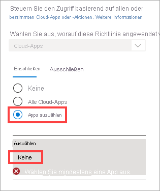
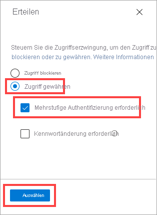

# Tutorial: Erzwingen der mehrstufigen Authentifizierung für B2B-Gastbenutzer

Bei der Zusammenarbeit mit externen B2B-Gastbenutzern wird empfohlen, Ihre Apps mit Richtlinien für die mehrstufige Authentifizierung (Multi-Factor Authentification, MFA) zu schützen. Denn dann benötigen externe Benutzer mehr als nur einen Benutzernamen und ein Kennwort, um auf Ihre Ressourcen zuzugreifen. In Azure Active Directory (Azure AD) ist dies mit einer Richtlinie für bedingten Zugriff möglich, die MFA für den Zugriff erfordert. MFA-Richtlinien können auf Mandanten-, App- oder individueller Benutzerebene erzwungen werden, so wie sie auch für Mitglieder Ihrer eigenen Organisation aktiviert werden können.

Beispiel:

1. Ein Administrator oder Mitarbeiter von Unternehmen A lädt einen Gastbenutzer ein, eine Cloud oder lokale Anwendung zu verwenden, die so konfiguriert ist, dass sie MFA für den Zugriff erfordert.
1. Der Gastbenutzer meldet sich mit seinem Geschäfts-, Schul- oder Unikonto bzw. mit seiner Identität bei einem sozialen Netzwerk an.
1. Der Benutzer wird aufgefordert, eine MFA auszuführen. 
1. Der Benutzer richtet die MFA bei Unternehmen A ein und wählt deren MFA-Option aus. Dem Benutzer wird der Zugriff auf die Anwendung gewährt.

In diesem Lernprogramm lernen Sie Folgendes:

> [!div class="checklist"]
> - Testen der Anmeldung vor dem MFA-Setup.
> - Erstellen einer Richtlinie für bedingten Zugriff, die MFA für den Zugriff auf eine Cloud-App in Ihrer Umgebung verlangt. In diesem Tutorial wird dieser Vorgang anhand der Microsoft Azure-Verwaltungs-App veranschaulicht.
> - Verwenden des What If-Tools zum Simulieren der MFA-Anmeldung.
> - Testen der Richtlinie für bedingten Zugriff.
> - Löschen des Testbenutzers und der Richtlinie.

Wenn Sie kein Azure-Abonnement besitzen, können Sie ein [kostenloses Konto](https://azure.microsoft.com/free/?WT.mc_id=A261C142F) erstellen, bevor Sie beginnen.

## Voraussetzungen

Für die Durchführung des Szenarios im Rahmen dieses Tutorials benötigen Sie Folgendes:

- **Zugriff auf Azure AD Premium**. Zum Funktionsumfang dieser Edition gehört die Richtlinie für bedingten Zugriff. Um MFA zu erzwingen, müssen Sie eine Azure AD-Richtlinie für bedingten Zugriff erstellen. Beachten Sie, dass MFA-Richtlinien in Ihrer Organisation immer durchgesetzt werden, unabhängig davon, ob Partner über MFA-Funktionen verfügen.
- **Ein gültiges externes E-Mail-Konto**, das Sie Ihrem Mandantenverzeichnis als Gastbenutzer hinzufügen und zum Anmelden verwenden können. Wie Sie ein Gastkonto erstellen, erfahren Sie unter [Hinzufügen von B2B-Gastbenutzern im Azure-Portal](add-users-administrator.md).

## Erstellen eines Testgastbenutzers in Azure AD

1. Melden Sie sich beim [Azure-Portal](https://portal.azure.com/) als Azure AD-Administrator an.
1. Wählen Sie im Azure-Portal die Option **Azure Active Directory** aus.
1. Wählen Sie im Menü auf der linken Seite unter **Verwalten** die Option **Benutzer** aus.
1. Klicken Sie auf **Neuer Gastbenutzer**.

    

1. Geben Sie unter **Identität** die E-Mail-Adresse des externen Benutzers ein. Geben Sie optional einen Namen und eine Begrüßungsnachricht ein.

    

1. Klicken Sie auf **Einladen**. Die Einladung wird daraufhin automatisch an den Gastbenutzer gesendet. Daraufhin wird die Meldung **Benutzer erfolgreich eingeladen.** angezeigt.
1. Nach dem Senden der Einladung wird das Benutzerkonto dem Verzeichnis automatisch als Gast hinzugefügt.

## Testen der Anmeldung vor dem MFA-Setup

1. Melden Sie sich mit Ihrem Testbenutzernamen und dem dazugehörigen Kennwort im [Azure-Portal](https://portal.azure.com/) an.
1. Beachten Sie, dass Sie auf das Azure-Portal nur mit Ihren Anmeldeinformationen zugreifen können. Eine zusätzliche Authentifizierung ist nicht erforderlich.
1. Melden Sie sich ab.

## Erstellen einer Richtlinie für bedingten Zugriff mit erforderlicher MFA

1. Melden Sie sich am [Azure-Portal](https://portal.azure.com/) als Sicherheitsadministrator oder Administrator für bedingten Zugriff an.
1. Wählen Sie im Azure-Portal die Option **Azure Active Directory** aus.
1. Wählen Sie im Menü auf der linken Seite unter **Verwalten** die Option **Sicherheit** aus.
1. Wählen Sie unter **Schützen** die Option **Bedingter Zugriff** aus.
1. Wählen Sie auf der Seite **Bedingter Zugriff** in der Symbolleiste oben **Neue Richtlinie** aus.
1. Geben Sie auf der Seite **Neu** im Textfeld **Name** **Mehrstufige Authentifizierung für Zugriff auf B2B-Portal erforderlich** ein.
1. Wählen Sie im Abschnitt **Zuweisungen** den Link unter **Benutzer und Gruppen** aus.
1. Wählen Sie auf der Seite **Benutzer und Gruppen** die Option **Benutzer und Gruppen auswählen** und dann **Alle Gast- und externen Benutzer** aus.

    
1. Wählen Sie im Abschnitt **Zuweisungen** den Link unter **Cloudanwendungen oder -aktionen** aus.
1. Wählen Sie **Apps auswählen** und dann den Link unter **Auswählen** aus.

    

1.  Wählen Sie auf der Seite **Auswählen** die Option **Microsoft Azure-Verwaltung** und dann **Auswählen** aus.

    

1.  Wählen Sie auf der Seite **Neu** im Abschnitt **Zugriffskontrollen** den Link unter **Gewähren** aus.
1.  Wählen Sie auf der Seite **Gewähren** die Option **Zugriff gewähren** aus, aktivieren Sie das Kontrollkästchen **Mehrstufige Authentifizierung erforderlich**, und wählen Sie dann **Auswählen** aus.

    

1.  Wählen Sie unter **Richtlinie aktivieren** die Option **An** aus.

    

1.  Klicken Sie auf **Erstellen**.

## Simuliertes Anmelden mit der What If-Option

1. Wählen Sie auf der Seite **Bedingter Zugriff | Richtlinien** die Option **What If** aus.

    

1. Wählen Sie den Link unter **Benutzer** aus. 
1. Geben Sie im Suchfeld den Namen Ihres Testgastbenutzers ein. Wählen Sie in den Suchergebnissen den Benutzer aus, und wählen Sie dann **Auswählen** aus.

    

1. Wählen Sie den Link unter **Cloud apps, actions, or authentication content** (Cloud-Apps, Aktionen oder Authentifizierungsinhalt) aus. . Wählen Sie **Apps auswählen** und dann den Link unter **Auswählen** aus.

    

1. Wählen Sie auf der Seite **Cloud-Apps** in der Anwendungsliste **Microsoft Azure-Verwaltung** und dann **Auswählen** aus.
1. Wählen Sie **What If** aus, und überprüfen Sie, ob Ihre neue Richtlinie auf der Registerkarte **Anzuwendende Richtlinien** unter **Auswertungsergebnisse** angezeigt wird.

    

## Testen der Richtlinie für bedingten Zugriff

1. Melden Sie sich mit Ihrem Testbenutzernamen und dem dazugehörigen Kennwort im [Azure-Portal](https://portal.azure.com/) an.
1. Sie sollten eine Anforderung für zusätzliche Authentifizierungsmethoden sehen. Beachten Sie, dass es einige Zeit dauern kann, bis die Richtlinie wirksam wird.

    

1. Melden Sie sich ab.

## Bereinigen von Ressourcen

Löschen Sie den Testbenutzer und die Testrichtlinie für bedingten Zugriff, wenn sie nicht mehr benötigt werden.

1. Melden Sie sich beim [Azure-Portal](https://portal.azure.com/) als Azure AD-Administrator an.
1. Wählen Sie im linken Bereich **Azure Active Directory** aus.
1. Wählen Sie unter **Verwalten** die Option **Benutzer** aus.
1. Wählen Sie den Testbenutzer und dann **Benutzer löschen** aus.
1. Wählen Sie im linken Bereich **Azure Active Directory** aus.
1. Wählen Sie unter **Sicherheit** **Bedingter Zugriff** aus.
1. Wählen Sie in der Liste **Richtlinienname** das Kontextmenü (...) für Ihre Testrichtlinie und dann **Löschen** aus. Klicken Sie auf **Ja**, um zu bestätigen.

## Nächste Schritte

In diesem Tutorial haben Sie eine Richtlinie für bedingten Zugriff erstellt, die voraussetzt, dass Gastbenutzer zum Anmelden bei einer Ihrer Cloud-Apps MFA verwenden. Weitere Informationen zum Hinzufügen von Gastbenutzern für die Zusammenarbeit finden Sie unter [Hinzufügen von Benutzern für die Azure Active Directory B2B-Zusammenarbeit im Azure-Portal](add-users-administrator.md).
