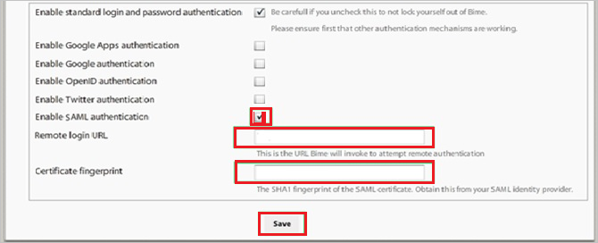
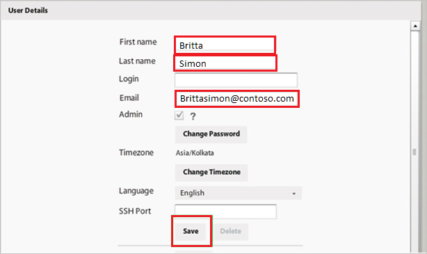

# Tutorial: Integration des einmaligen Anmeldens (Single Sign-On, SSO) von Azure AD mit Bime

In diesem Tutorial erfahren Sie, wie Sie Bime in Azure Active Directory (Azure AD) integrieren. Die Integration von Bime in Azure AD ermöglicht Folgendes:

* Steuern Sie in Azure AD, wer Zugriff auf Bime hat.
* Ermöglichen Sie es Ihren Benutzern, sich mit ihren Azure AD-Konten automatisch bei Bime anzumelden.
* Verwalten Sie Ihre Konten zentral im Azure-Portal.

## Voraussetzungen

Für die ersten Schritte benötigen Sie Folgendes:

* Ein Azure AD-Abonnement Falls Sie über kein Abonnement verfügen, können Sie ein [kostenloses Azure-Konto](https://azure.microsoft.com/free/) verwenden.
* Bime-Abonnement, für das einmaliges Anmelden (Single Sign-On, SSO) aktiviert ist

## Beschreibung des Szenarios

In diesem Tutorial konfigurieren und testen Sie das einmalige Anmelden von Azure AD in einer Testumgebung.

* Bime unterstützt **SP**-initiiertes einmaliges Anmelden.

## Hinzufügen von Bime aus dem Katalog

Zum Konfigurieren der Integration von Bime in Azure AD müssen Sie Bime aus dem Katalog Ihrer Liste der verwalteten SaaS-Apps hinzufügen.

1. Melden Sie sich mit einem Geschäfts-, Schul- oder Unikonto oder mit einem persönlichen Microsoft-Konto beim Azure-Portal an.
1. Wählen Sie im linken Navigationsbereich den Dienst **Azure Active Directory** aus.
1. Navigieren Sie zu **Unternehmensanwendungen**, und wählen Sie dann **Alle Anwendungen** aus.
1. Wählen Sie zum Hinzufügen einer neuen Anwendung **Neue Anwendung** aus.
1. Geben Sie im Abschnitt **Aus Katalog hinzufügen** den Suchbegriff **Bime** in das Suchfeld ein.
1. Wählen Sie im Ergebnisbereich **Bime** aus, und fügen Sie dann die App hinzu. Warten Sie einige Sekunden, während die App Ihrem Mandanten hinzugefügt wird.

## Konfigurieren und Testen des einmaligen Anmeldens von Azure AD für Bime

Konfigurieren und testen Sie das einmalige Anmelden von Azure AD mit Bime mithilfe eines Testbenutzers mit dem Namen **B. Simon**. Damit einmaliges Anmelden funktioniert, muss eine Linkbeziehung zwischen einem Azure AD-Benutzer und dem entsprechenden Benutzer in Bime eingerichtet werden.

Führen Sie zum Konfigurieren und Testen des einmaligen Anmeldens von Azure AD mit Bime die folgenden Schritte aus:

1. **[Konfigurieren des einmaligen Anmeldens von Azure AD](#configure-azure-ad-sso)** , um Ihren Benutzern die Verwendung dieses Features zu ermöglichen.
    1. **[Erstellen eines Azure AD-Testbenutzers](#create-an-azure-ad-test-user)** , um das einmalige Anmelden von Azure AD mit dem Testbenutzer B. Simon zu testen.
    1. **[Zuweisen des Azure AD-Testbenutzers](#assign-the-azure-ad-test-user)** , um B. Simon die Verwendung des einmaligen Anmeldens von Azure AD zu ermöglichen.
1. **[Konfigurieren des einmaligen Anmeldens für Bime](#configure-bime-sso)**, um die Einstellungen für einmaliges Anmelden auf der Anwendungsseite zu konfigurieren
    1. **[Erstellen eines Bime-Testbenutzers](#create-bime-test-user)**, um in Bime ein Pendant von B. Simon zu erhalten, das mit ihrer Darstellung in Azure AD verknüpft ist
1. **[Testen des einmaligen Anmeldens](#test-sso)** , um zu überprüfen, ob die Konfiguration funktioniert

## Konfigurieren des einmaligen Anmeldens (Single Sign-On, SSO) von Azure AD

Gehen Sie wie folgt vor, um das einmalige Anmelden von Azure AD im Azure-Portal zu aktivieren.

1. Navigieren Sie im Azure-Portal auf der Anwendungsintegrationsseite für **Bime** zum Abschnitt **Verwalten**, und wählen Sie **Einmaliges Anmelden** aus.
1. Wählen Sie auf der Seite **SSO-Methode auswählen** die Methode **SAML** aus.
1. Klicken Sie auf der Seite **Einmaliges Anmelden (SSO) mit SAML einrichten** auf das Stiftsymbol für **Grundlegende SAML-Konfiguration**, um die Einstellungen zu bearbeiten.

   

4. Führen Sie im Abschnitt **Grundlegende SAML-Konfiguration** die folgenden Schritte aus:

    a. Geben Sie im Textfeld **Bezeichner (Entitäts-ID)** eine URL im folgenden Format ein: `https://<tenant-name>.Bimeapp.com`.

    b. Geben Sie im Textfeld **Anmelde-URL** eine URL im folgenden Format ein: `https://<tenant-name>.Bimeapp.com`.

    > [!NOTE]
    > Hierbei handelt es sich um Beispielwerte. Ersetzen Sie diese Werte durch den tatsächlichen Bezeichner und die tatsächliche Anmelde-URL. Wenden Sie sich an das [Clientsupportteam von Bime](https://bime.zendesk.com/hc/categories/202604307-Support-tech-notes-and-tips-), um diese Werte zu erhalten. Sie können sich auch die Muster im Abschnitt **Grundlegende SAML-Konfiguration** im Azure-Portal ansehen.

5. Klicken Sie im Abschnitt **SAML-Signaturzertifikat** auf die Schaltfläche **Bearbeiten**, um das Dialogfeld **SAML-Signaturzertifikat** zu öffnen.

    

6. Kopieren Sie im Abschnitt **SAML-Signaturzertifikat** den **FINGERABDRUCK**, und speichern Sie ihn auf Ihrem Computer.

    

7. Kopieren Sie im Abschnitt **Bime einrichten** die entsprechenden URLs gemäß Ihren Anforderungen.

    

### Erstellen eines Azure AD-Testbenutzers

In diesem Abschnitt erstellen Sie im Azure-Portal einen Testbenutzer mit dem Namen B. Simon.

1. Wählen Sie im linken Bereich des Microsoft Azure-Portals **Azure Active Directory** > **Benutzer** > **Alle Benutzer** aus.
1. Wählen Sie oben im Bildschirm die Option **Neuer Benutzer** aus.
1. Führen Sie unter den Eigenschaften für **Benutzer** die folgenden Schritte aus:
   1. Geben Sie im Feld **Name** die Zeichenfolge `B.Simon` ein.  
   1. Geben Sie im Feld **Benutzername** die Zeichenfolge username@companydomain.extension ein. Beispiel: `B.Simon@contoso.com`.
   1. Aktivieren Sie das Kontrollkästchen **Kennwort anzeigen**, und notieren Sie sich den Wert aus dem Feld **Kennwort**.
   1. Klicken Sie auf **Erstellen**.

### Zuweisen des Azure AD-Testbenutzers

In diesem Abschnitt ermöglichen Sie B. Simon die Verwendung des einmaligen Anmeldens von Azure, indem Sie ihr Zugriff auf Bime gewähren.

1. Wählen Sie im Azure-Portal **Unternehmensanwendungen** > **Alle Anwendungen** aus.
1. Wählen Sie in der Anwendungsliste die Option **Bime** aus.
1. Navigieren Sie auf der Übersichtsseite der App zum Abschnitt **Verwalten**, und wählen Sie **Benutzer und Gruppen** aus.
1. Wählen Sie **Benutzer hinzufügen** und anschließend im Dialogfeld **Zuweisung hinzufügen** die Option **Benutzer und Gruppen** aus.
1. Wählen Sie im Dialogfeld **Benutzer und Gruppen** in der Liste „Benutzer“ den Eintrag **B. Simon** aus, und klicken Sie dann unten auf dem Bildschirm auf die Schaltfläche **Auswählen**.
1. Wenn den Benutzern eine Rolle zugewiesen werden soll, können Sie sie im Dropdownmenü **Rolle auswählen** auswählen. Wurde für diese App keine Rolle eingerichtet, ist die Rolle „Standardzugriff“ ausgewählt.
1. Klicken Sie im Dialogfeld **Zuweisung hinzufügen** auf die Schaltfläche **Zuweisen**.

## Konfigurieren des einmaligen Anmeldens für Bime

1. Melden Sie sich in einem anderen Webbrowserfenster bei der Bime-Unternehmenswebsite als Administrator an.

2. Klicken Sie auf der Symbolleiste auf **Administration** und dann auf **Konto**.

    

3. Führen Sie auf der Kontenkonfigurationsseite die folgenden Schritte aus:

    

    a. Aktivieren Sie **Enable SAML authentication**.

    b. Fügen Sie in das Textfeld **Remote Login URL** (Remoteanmelde-URL) den Wert der **Anmelde-URL** ein, den Sie aus dem Azure-Portal kopiert haben.

    c. Fügen Sie in das Textfeld **Certificate Fingerprint** (Fingerabdruck des Zertifikats) den Wert **Fingerabdruck** des Zertifikats ein, den Sie aus dem Azure-Portal kopiert haben.

    d. Klicken Sie auf **Speichern**.

### Erstellen eines Bime-Testbenutzers

Damit sich Azure AD-Benutzer bei Bime anmelden können, müssen sie in Bime bereitgestellt werden. Im Fall von Bime ist die Bereitstellung eine manuelle Aufgabe.

**Um die Benutzerbereitstellung zu konfigurieren, führen Sie die folgenden Schritte durch:**

1. Melden Sie sich bei Ihrem **Bime** -Mandanten an.

2. Klicken Sie auf der Symbolleiste auf **Administration** und dann auf **Benutzer**.

    

3. Klicken Sie unter **Benutzerliste** auf **Neuen Benutzer hinzufügen** („+“).

    

4. Führen Sie auf der Dialogfeldseite **User Details** die folgenden Schritte aus:

    

    a. Geben Sie im Textfeld **Vorname** den Vornamen des Benutzers ein (z.B. **Britta**).

    b. Geben Sie im Textfeld **Nachname** den Nachnamen des Benutzers ein (z.B. **Simon**).

    c. Geben Sie im Textfeld **E-Mail** die E-Mail-Adresse des Benutzers ein, z. B. **brittasimon\@contoso.com**.

    d. Klicken Sie auf **Speichern**.

> [!NOTE]
> Sie können Azure AD-Benutzerkonten auch mit anderen Tools zum Erstellen von Bime-Benutzerkonten oder mit den APIs von Bime bereitstellen.

## Testen des einmaligen Anmeldens

In diesem Abschnitt testen Sie die Azure AD-Konfiguration für einmaliges Anmelden mit den folgenden Optionen: 

* Klicken Sie im Azure-Portal auf **Diese Anwendung testen**. Dadurch werden Sie zur Anmelde-URL für Bime weitergeleitet, wo Sie den Anmeldeflow initiieren können. 

* Navigieren Sie direkt zur Anmelde-URL von Bime, und initiieren Sie dort den Anmeldeflow.

* Sie können „Meine Apps“ von Microsoft verwenden. Wenn Sie unter „Meine Apps“ auf die Kachel „Bime“ klicken, werden Sie zur Anmelde-URL für Bime weitergeleitet. Weitere Informationen zu „Meine Apps“ finden Sie in [dieser Einführung](../user-help/my-apps-portal-end-user-access.md).

## Nächste Schritte

Nach dem Konfigurieren von Bime können Sie die Sitzungssteuerung erzwingen, die in Echtzeit vor der Exfiltration und Infiltration vertraulicher Unternehmensdaten schützt. Die Sitzungssteuerung basiert auf bedingtem Zugriff. [Erfahren Sie, wie Sie die Sitzungssteuerung mit Microsoft Defender for Cloud Apps erzwingen.](/cloud-app-security/proxy-deployment-aad)
