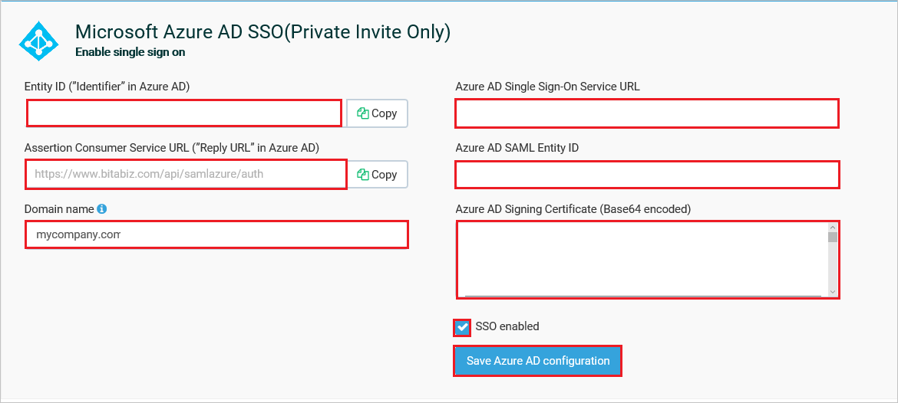
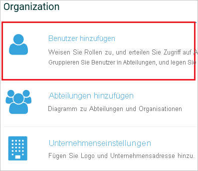

# Tutorial: Azure Active Directory-Integration mit BitaBIZ

In diesem Tutorial erfahren Sie, wie Sie BitaBIZ in Azure Active Directory (Azure AD) integrieren. Die Integration von BitaBIZ in Azure AD ermöglicht Folgendes:

* Steuern in Azure AD, wer Zugriff auf BitaBIZ besitzt.
* Benutzer können sich mit ihren Azure AD-Konten automatisch bei BitaBIZ anmelden.
* Verwalten Sie Ihre Konten zentral im Azure-Portal.

## Voraussetzungen

Zum Konfigurieren der Azure AD-Integration mit BitaBIZ benötigen Sie Folgendes:

* Ein Azure AD-Abonnement Sollten Sie nicht über eine Azure AD-Umgebung verfügen, können Sie ein [kostenloses Konto](https://azure.microsoft.com/free/) verwenden.
* Ein BitaBIZ-Abonnement, für das einmaliges Anmelden aktiviert ist.

## Beschreibung des Szenarios

In diesem Tutorial konfigurieren und testen Sie das einmalige Anmelden von Azure AD in einer Testumgebung.

* BitaBIZ unterstützt **SP- und IDP**-initiiertes einmaliges Anmelden.
* BitaBIZ unterstützt [Automatisierte Benutzerbereitstellung](bitabiz-provisioning-tutorial.md).

## Hinzufügen von BitaBIZ aus dem Katalog

Zum Konfigurieren der Integration von BitaBIZ in Azure AD müssen Sie BitaBIZ aus dem Katalog der Liste mit den verwalteten SaaS-Apps hinzufügen.

1. Melden Sie sich mit einem Geschäfts-, Schul- oder Unikonto oder mit einem persönlichen Microsoft-Konto beim Azure-Portal an.
1. Wählen Sie im linken Navigationsbereich den Dienst **Azure Active Directory** aus.
1. Navigieren Sie zu **Unternehmensanwendungen**, und wählen Sie dann **Alle Anwendungen** aus.
1. Wählen Sie zum Hinzufügen einer neuen Anwendung **Neue Anwendung** aus.
1. Geben Sie im Abschnitt **Aus Katalog hinzufügen** den Suchbegriff **BitaBIZ** in das Suchfeld ein.
1. Wählen Sie im Ergebnisbereich **BitaBIZ** aus, und fügen Sie die App dann hinzu. Warten Sie einige Sekunden, während die App Ihrem Mandanten hinzugefügt wird.

## Konfigurieren und Testen von Azure AD-SSO für BitaBIZ

Konfigurieren und testen Sie das einmalige Anmelden von Azure AD mit BitaBIZ mithilfe eines Testbenutzers mit dem Namen **B. Simon**. Damit einmaliges Anmelden funktioniert, muss eine Linkbeziehung zwischen einem Azure AD-Benutzer und dem entsprechenden Benutzer in BitaBIZ eingerichtet werden.

Führen Sie die folgenden Schritte aus, um Azure AD-SSO mit BitaBIZ zu konfigurieren und zu testen:

1. **[Konfigurieren des einmaligen Anmeldens von Azure AD](#configure-azure-ad-sso)** , um Ihren Benutzern die Verwendung dieses Features zu ermöglichen.
    1. **[Erstellen eines Azure AD-Testbenutzers](#create-an-azure-ad-test-user)** , um das einmalige Anmelden mit Azure AD mit dem Testbenutzer Britta Simon zu testen.
    1. **[Zuweisen des Azure AD-Testbenutzers](#assign-the-azure-ad-test-user)** , um Britta Simon für das einmalige Anmelden von Azure AD zu aktivieren.
2. **[Konfigurieren von SSO für BitaBIZ](#configure-bitabiz-sso)** , um die Einstellungen für einmaliges Anmelden auf der Anwendungsseite zu konfigurieren.
    1. **[Erstellen eines BitaBIZ-Testbenutzers](#create-bitabiz-test-user)** , um in BitaBIZ eine Entsprechung von Britta Simon zu erhalten, die mit ihrer Darstellung in Azure AD verknüpft ist
1. **[Testen des einmaligen Anmeldens](#test-sso)** , um zu überprüfen, ob die Konfiguration funktioniert

## Konfigurieren des einmaligen Anmeldens (Single Sign-On, SSO) von Azure AD

Gehen Sie wie folgt vor, um das einmalige Anmelden von Azure AD im Azure-Portal zu aktivieren.

1. Navigieren Sie im Azure-Portal auf der Anwendungsintegrationsseite für **BitaBIZ** zum Abschnitt **Verwalten**, und wählen Sie **Einmaliges Anmelden** aus.
1. Wählen Sie auf der Seite **SSO-Methode auswählen** die Methode **SAML** aus.
1. Klicken Sie auf der Seite **Einmaliges Anmelden (SSO) mit SAML einrichten** auf das Stiftsymbol für **Grundlegende SAML-Konfiguration**, um die Einstellungen zu bearbeiten.

   

4. Führen Sie im Abschnitt **Grundlegende SAML-Konfiguration** die folgenden Schritte aus, wenn Sie die Anwendung im **IDP-initiierten** Modus konfigurieren möchten:

    Geben Sie im Textfeld **Bezeichner** eine URL im folgenden Format ein: `https://www.bitabiz.com/<INSTANCE_ID>`.

    > [!NOTE]
    > Der Wert in der obigen URL dient lediglich zur Veranschaulichung. Ersetzen Sie ihn durch den tatsächlichen Bezeichner. Dies wird später in diesem Tutorial beschrieben.

5. Klicken Sie auf **Zusätzliche URLs festlegen**, und führen Sie den folgenden Schritt aus, wenn Sie die Anwendung im **SP-initiierten Modus** konfigurieren möchten:

    Geben Sie im Textfeld **Anmelde-URL** die URL ein: `https://www.bitabiz.com/dashboard`.

6. Klicken Sie auf der Seite **Einmaliges Anmelden (SSO) mit SAML einrichten** im Abschnitt **SAML-Signaturzertifikat** auf **Herunterladen**, um das Ihrer Anforderung entsprechende **Zertifikat (Base64)** aus den angegebenen Optionen herunterzuladen und auf Ihrem Computer zu speichern.

    

7. Kopieren Sie im Abschnitt **BitaBIZ**{3}einrichten{4} die entsprechenden URLs gemäß Ihren Anforderungen.

    

### Erstellen eines Azure AD-Testbenutzers

In diesem Abschnitt erstellen Sie im Azure-Portal einen Testbenutzer mit dem Namen B. Simon.

1. Wählen Sie im linken Bereich des Microsoft Azure-Portals **Azure Active Directory** > **Benutzer** > **Alle Benutzer** aus.
1. Wählen Sie oben im Bildschirm die Option **Neuer Benutzer** aus.
1. Führen Sie unter den Eigenschaften für **Benutzer** die folgenden Schritte aus:
   1. Geben Sie im Feld **Name** die Zeichenfolge `B.Simon` ein.  
   1. Geben Sie im Feld **Benutzername** die Zeichenfolge username@companydomain.extension ein. Beispiel: `B.Simon@contoso.com`.
   1. Aktivieren Sie das Kontrollkästchen **Kennwort anzeigen**, und notieren Sie sich den Wert aus dem Feld **Kennwort**.
   1. Klicken Sie auf **Erstellen**.

### Zuweisen des Azure AD-Testbenutzers

In diesem Abschnitt ermöglichen Sie B. Simon die Verwendung des einmaligen Anmeldens von Azure, indem Sie Zugriff auf BitaBIZ gewähren.

1. Wählen Sie im Azure-Portal **Unternehmensanwendungen** > **Alle Anwendungen** aus.
1. Wählen Sie in der Anwendungsliste die Option **BitaBIZ** aus.
1. Navigieren Sie auf der Übersichtsseite der App zum Abschnitt **Verwalten**, und wählen Sie **Benutzer und Gruppen** aus.
1. Wählen Sie **Benutzer hinzufügen** und anschließend im Dialogfeld **Zuweisung hinzufügen** die Option **Benutzer und Gruppen** aus.
1. Wählen Sie im Dialogfeld **Benutzer und Gruppen** in der Liste „Benutzer“ den Eintrag **B. Simon** aus, und klicken Sie dann unten auf dem Bildschirm auf die Schaltfläche **Auswählen**.
1. Wenn den Benutzern eine Rolle zugewiesen werden soll, können Sie sie im Dropdownmenü **Rolle auswählen** auswählen. Wurde für diese App keine Rolle eingerichtet, ist die Rolle „Standardzugriff“ ausgewählt.
1. Klicken Sie im Dialogfeld **Zuweisung hinzufügen** auf die Schaltfläche **Zuweisen**.

## Konfigurieren von SSO für BitaBIZ

1. Melden Sie sich in einem anderen Webbrowserfenster als Administrator bei Ihrem BitaBIZ-Mandanten an.

2. Klicken Sie auf **SETUP ADMIN** (ADMINISTRATOR EINRICHTEN).

    

3. Klicken Sie im Abschnitt **Add value** (Aufwerten) auf **Microsoft integrations** (Microsoft-Integrationen).

    

4. Scrollen Sie zum Abschnitt **Microsoft Azure AD (Enable single sign on)** (Microsoft Azure AD (einmaliges Anmelden aktivieren)), und führen Sie die folgenden Schritte aus:

    

    a. Kopieren Sie den Wert aus dem Textfeld **Entity ID (”Identifier” in Azure AD)** (Entitäts-ID ("Bezeichner" in Azure AD)), und fügen Sie ihn im Azure-Portal im Abschnitt **Grundlegende SAML-Konfiguration** in das Textfeld **Bezeichner** ein. 

    b. Fügen Sie im Textfeld **Azure AD Single Sign-On Service URL** (Azure AD-Dienst-URL für einmaliges Anmelden) die **Anmelde-URL** ein, die Sie aus dem Azure-Portal kopiert haben.

    c. Fügen Sie in das Textfeld **Azure AD SAML Entity ID** (Azure AD-SAML-Entitäts-ID) den Wert für **Azure AD-Bezeichner** ein, den Sie aus dem Azure-Portal kopiert haben.

    d. Öffnen Sie das heruntergeladene **Zertifikat (Base64)** in Editor, kopieren Sie den Inhalt in die Zwischenablage, und fügen Sie ihn anschließend in das Textfeld **Azure AD Signing Certificate (Base64 encoded)** (Azure AD-Signaturzertifikat (Base64-codiert) ein.

    e. Fügen Sie Ihren geschäftlichen E-Mail-Domänennamen (mycompany.com) in das Textfeld **Domain name** (Domänenname) ein, um SSO den Benutzern in Ihrem Unternehmen mit dieser E-Mail-Domäne zuzuweisen (OPTIONAL).

    f. Aktivieren Sie das Kontrollkästchen **SSO enabled** (SSO aktiviert) für das BitaBIZ-Konto.

    g. Klicken Sie auf **Save Azure AD configuration** (Azure AD-Konfiguration speichern), um die SSO-Konfiguration zu speichern und zu aktivieren.

### Erstellen eines BitaBIZ-Testbenutzers

Damit sich Azure AD-Benutzer bei BitaBIZ anmelden können, müssen sie in BitaBIZ bereitgestellt werden.  
Im Fall von BitaBIZ muss die Bereitstellung manuell durchgeführt werden.

**Führen Sie zum Bereitstellen eines Benutzerkontos die folgenden Schritte aus:**

1. Melden Sie sich bei Ihrer BitaBIZ-Unternehmenswebsite als Administrator an.

2. Klicken Sie auf **SETUP ADMIN** (ADMINISTRATOR EINRICHTEN).

    

3. Klicken Sie im Abschnitt **Organization** (Organisation) auf **Add users** (Benutzer hinzufügen).

    

4. Klicken Sie auf **Add new employee** (Neuen Mitarbeiter hinzufügen).

    

5. Führen Sie auf der Dialogfeldseite **Add new employee** (Neuen Mitarbeiter hinzufügen) die folgenden Schritte aus:

    

    a. Geben Sie im Textfeld **First Name** (Vorname) den Vornamen des Benutzers ein (beispielsweise „Britta“).

    b. Geben Sie im Textfeld **Last Name** (Nachname) den Nachnamen des Benutzers ein (beispielsweise „Simon“).

    c. Geben Sie im Textfeld **E-Mail-Adresse** die E-Mail-Adresse des Benutzers, z.B. Brittasimon@contoso.com, ein.

    d. Wählen Sie unter **Date of employment** (Einstellungsdatum) ein Datum aus.

    e. Für den Benutzer können optional noch weitere Benutzerattribute eingerichtet werden. Ausführlichere Informationen finden Sie in der [Dokumentation für die Mitarbeitereinrichtung](https://help.bitabiz.dk/manage-or-set-up-your-account/on-boarding-employees/new-employee).

    f. Klicken Sie auf **Save employee** (Mitarbeiter speichern).

    > [!NOTE]
    > Der Besitzer des Azure Active Directory-Kontos erhält eine E-Mail und folgt einem Link zur Bestätigung des Kontos, bevor es aktiv wird.

> [!NOTE]
>Außerdem unterstützt BitaBIZ automatische Benutzerbereitstellung. Weitere Informationen zum Konfigurieren der automatischen Benutzerbereitstellung finden Sie [hier](./bitabiz-provisioning-tutorial.md).

## Testen des einmaligen Anmeldens

In diesem Abschnitt testen Sie die Azure AD-Konfiguration für einmaliges Anmelden mit den folgenden Optionen: 

#### SP-initiiert:

* Klicken Sie im Azure-Portal auf **Diese Anwendung testen**. Dadurch werden Sie zur Anmelde-URL für BitaBIZ weitergeleitet. Dort können Sie den Anmeldeflow initiieren.  

* Rufen Sie die Anmelde-URL für BitaBIZ direkt auf, und initiieren Sie den Anmeldeflow.

#### IDP-initiiert:

* Klicken Sie im Azure-Portal auf **Diese Anwendung testen**. Dadurch sollten Sie automatisch bei der BitaBIZ-Instanz angemeldet werden, für die Sie einmaliges Anmelden eingerichtet haben. 

Sie können auch den Microsoft-Bereich „Meine Apps“ verwenden, um die Anwendung in einem beliebigen Modus zu testen. Beim Klicken auf die Kachel „BitaBIZ“ in „Meine Apps“ geschieht Folgendes: Wenn Sie die Anwendung im SP-Modus konfiguriert haben, werden Sie zum Initiieren des Anmeldeflows zur Anmeldeseite der Anwendung weitergeleitet. Wenn Sie die Anwendung im IDP-Modus konfiguriert haben, sollten Sie automatisch bei der BitaBIZ-Instanz angemeldet werden, für die Sie einmaliges Anmelden eingerichtet haben. Weitere Informationen zu „Meine Apps“ finden Sie in [dieser Einführung](../user-help/my-apps-portal-end-user-access.md).

## Nächste Schritte

Nach dem Konfigurieren von BitaBIZ können Sie Sitzungssteuerung erzwingen, die in Echtzeit vor der Exfiltration und Infiltration vertraulicher Unternehmensdaten schützt. Die Sitzungssteuerung basiert auf bedingtem Zugriff. [Erfahren Sie, wie Sie die Sitzungssteuerung mit Microsoft Defender for Cloud Apps erzwingen.](/cloud-app-security/proxy-deployment-aad)
