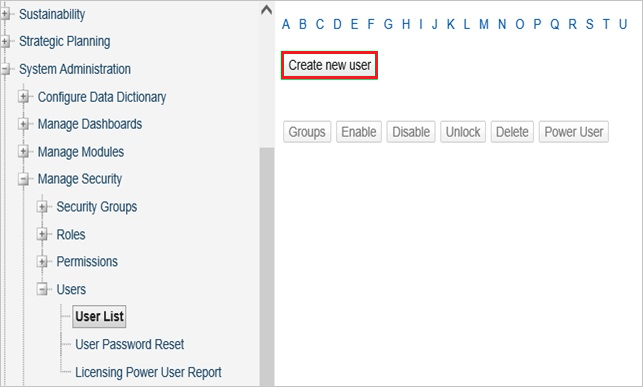
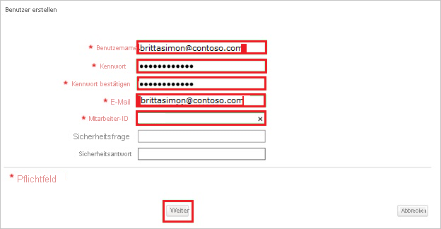

# Tutorial: Integration von Azure AD-SSO in FM:Systems

In diesem Tutorial erfahren Sie, wie Sie FM:Systems in Azure Active Directory (Azure AD) integrieren. Die Integration von FM:Systems in Azure AD ermöglicht Folgendes:

* Steuern in Azure AD, wer Zugriff auf FM:Systems besitzt.
* Benutzer können sich mit ihren Azure AD-Konten automatisch bei FM:Systems anmelden.
* Verwalten Sie Ihre Konten zentral im Azure-Portal.

## Voraussetzungen

Um die Azure AD-Integration mit FM:Systems konfigurieren zu können, benötigen Sie Folgendes:

* Ein Azure AD-Abonnement Sollten Sie nicht über eine Azure AD-Umgebung verfügen, können Sie ein [kostenloses Konto](https://azure.microsoft.com/free/) verwenden.
* FM:Systems-Abonnement, für das einmaliges Anmelden aktiviert ist.

## Beschreibung des Szenarios

In diesem Tutorial konfigurieren und testen Sie das einmalige Anmelden von Azure AD in einer Testumgebung.

* FM:Systems unterstützt **IDP**-initiiertes einmaliges Anmelden.

> [!NOTE]
> Der Bezeichner dieser Anwendung ist ein fester Zeichenfolgenwert, daher kann in einem Mandanten nur eine Instanz konfiguriert werden.

## Hinzufügen von FM:Systems aus dem Katalog

Zum Konfigurieren der Integration von FM:Systems in Azure AD müssen Sie FM:Systems aus dem Katalog der Liste der verwalteten SaaS-Apps hinzufügen.

1. Melden Sie sich mit einem Geschäfts-, Schul- oder Unikonto oder mit einem persönlichen Microsoft-Konto beim Azure-Portal an.
1. Wählen Sie im linken Navigationsbereich den Dienst **Azure Active Directory** aus.
1. Navigieren Sie zu **Unternehmensanwendungen**, und wählen Sie dann **Alle Anwendungen** aus.
1. Wählen Sie zum Hinzufügen einer neuen Anwendung **Neue Anwendung** aus.
1. Geben Sie im Abschnitt **Aus Katalog hinzufügen** den Suchbegriff **FM:Systems** in das Suchfeld ein.
1. Wählen Sie im Ergebnisbereich **FM:Systems** aus, und fügen Sie die App dann hinzu. Warten Sie einige Sekunden, während die App Ihrem Mandanten hinzugefügt wird.

## Konfigurieren und Testen von Azure AD-SSO für FM:Systems

Konfigurieren und testen Sie das einmalige Anmelden von Azure AD mit FM:Systems mithilfe eines Testbenutzers mit dem Namen **B. Simon**. Damit einmaliges Anmelden funktioniert, muss eine Linkbeziehung zwischen einem Azure AD-Benutzer und dem entsprechenden Benutzer in FM:Systems eingerichtet werden.

Führen Sie zum Konfigurieren und Testen von Azure AD-SSO mit FM:Systems die folgenden Schritte aus:

1. **[Konfigurieren des einmaligen Anmeldens von Azure AD](#configure-azure-ad-sso)** , um Ihren Benutzern die Verwendung dieses Features zu ermöglichen.
    1. **[Erstellen eines Azure AD-Testbenutzers](#create-an-azure-ad-test-user)** , um das einmalige Anmelden von Azure AD mit dem Testbenutzer B. Simon zu testen.
    1. **[Zuweisen des Azure AD-Testbenutzers](#assign-the-azure-ad-test-user)** , um B. Simon die Verwendung des einmaligen Anmeldens von Azure AD zu ermöglichen.
1. **[Konfigurieren von SSO für FM:Systems](#configure-fmsystems-sso)** , um die Einstellungen für einmaliges Anmelden auf der Anwendungsseite zu konfigurieren.
    1. **[Erstellen eines FM:Systems-Testbenutzers](#create-fmsystems-test-user)** , um eine Entsprechung von B. Simon in FM:Systems zu erhalten, die mit der Darstellung des Benutzers in Azure AD verknüpft ist.
1. **[Testen des einmaligen Anmeldens](#test-sso)** , um zu überprüfen, ob die Konfiguration funktioniert

## Konfigurieren des einmaligen Anmeldens (Single Sign-On, SSO) von Azure AD

Gehen Sie wie folgt vor, um das einmalige Anmelden von Azure AD im Azure-Portal zu aktivieren.

1. Navigieren Sie im Azure-Portal auf der Anwendungsintegrationsseite für **FM:Systems** zum Abschnitt **Verwalten**, und wählen Sie **Einmaliges Anmelden** aus.
1. Wählen Sie auf der Seite **SSO-Methode auswählen** die Methode **SAML** aus.
1. Klicken Sie auf der Seite **Einmaliges Anmelden (SSO) mit SAML einrichten** auf das Stiftsymbol für **Grundlegende SAML-Konfiguration**, um die Einstellungen zu bearbeiten.

   

4. Führen Sie im Abschnitt **Grundlegende SAML-Konfiguration** den folgenden Schritt aus:

    Geben Sie im Textfeld **Antwort-URL** eine URL im folgenden Format ein: `https://<companyname>.fmshosted.com/fminteract/ConsumerService2.aspx`.
    
    > [!NOTE]
    > Dieser Wert entspricht nicht dem tatsächlichen Wert. Aktualisieren Sie den Wert mit der richtigen Antwort-URL. Wenden Sie sich an das [Kundensupportteam von FM:Systems](https://fmsystems.com/support-services/), um den Wert zu erhalten. Sie können sich auch die Muster im Abschnitt **Grundlegende SAML-Konfiguration** im Azure-Portal ansehen.

5. Klicken Sie auf der Seite **Einmaliges Anmelden (SSO) mit SAML einrichten** im Abschnitt **SAML-Signaturzertifikat** auf **Herunterladen**, um den Ihren Anforderungen entsprechenden **Verbundmetadaten-XML**-Code aus den verfügbaren Optionen herunterzuladen und auf Ihrem Computer zu speichern.

    

6. Kopieren Sie im Abschnitt **FM:Systems einrichten** die entsprechenden URLs gemäß Ihren Anforderungen.

    

### Erstellen eines Azure AD-Testbenutzers 

In diesem Abschnitt erstellen Sie im Azure-Portal einen Testbenutzer mit dem Namen B. Simon.

1. Wählen Sie im linken Bereich des Microsoft Azure-Portals **Azure Active Directory** > **Benutzer** > **Alle Benutzer** aus.
1. Wählen Sie oben im Bildschirm die Option **Neuer Benutzer** aus.
1. Führen Sie unter den Eigenschaften für **Benutzer** die folgenden Schritte aus:
   1. Geben Sie im Feld **Name** die Zeichenfolge `B.Simon` ein.  
   1. Geben Sie im Feld **Benutzername** die Zeichenfolge username@companydomain.extension ein. Beispiel: `B.Simon@contoso.com`.
   1. Aktivieren Sie das Kontrollkästchen **Kennwort anzeigen**, und notieren Sie sich den Wert aus dem Feld **Kennwort**.
   1. Klicken Sie auf **Erstellen**.

### Zuweisen des Azure AD-Testbenutzers

In diesem Abschnitt ermöglichen Sie B. Simon die Verwendung des einmaligen Anmeldens von Azure, indem Sie Zugriff auf FM:Systems gewähren.

1. Wählen Sie im Azure-Portal **Unternehmensanwendungen** > **Alle Anwendungen** aus.
1. Wählen Sie in der Anwendungsliste **FM:Systems** aus.
1. Navigieren Sie auf der Übersichtsseite der App zum Abschnitt **Verwalten**, und wählen Sie **Benutzer und Gruppen** aus.
1. Wählen Sie **Benutzer hinzufügen** und anschließend im Dialogfeld **Zuweisung hinzufügen** die Option **Benutzer und Gruppen** aus.
1. Wählen Sie im Dialogfeld **Benutzer und Gruppen** in der Liste „Benutzer“ den Eintrag **B. Simon** aus, und klicken Sie dann unten auf dem Bildschirm auf die Schaltfläche **Auswählen**.
1. Wenn den Benutzern eine Rolle zugewiesen werden soll, können Sie sie im Dropdownmenü **Rolle auswählen** auswählen. Wurde für diese App keine Rolle eingerichtet, ist die Rolle „Standardzugriff“ ausgewählt.
1. Klicken Sie im Dialogfeld **Zuweisung hinzufügen** auf die Schaltfläche **Zuweisen**.

## Konfigurieren von SSO für FM:Systems

Zum Konfigurieren des einmaligen Anmeldens aufseiten von **FM:Systems** müssen Sie die heruntergeladene **Verbundmetadaten-XML** und die kopierten URLs aus dem Azure-Portal an das [Supportteam von FM:Systems](https://fmsystems.com/support-services/) senden. Es führt die Einrichtung durch, damit die SAML-SSO-Verbindung auf beiden Seiten richtig festgelegt ist.

### Erstellen eines FM:Systems-Testbenutzers

1. Melden Sie sich in einem anderen Webbrowserfenster an der FM:Systems-Unternehmenswebsite als Administrator an.

2. Navigieren Sie zu **Systemadministration \> Sicherheit verwalten \> Benutzer \> Benutzerliste**.
   
    

3. Klicken Sie auf **Neuen Benutzer erstellen**.
   
    

4. Führen Sie im Abschnitt **Benutzer erstellen** die folgenden Schritte aus:
   
    
   
    a. Füllen Sie die Textfelder **Benutzername**, **Kennwort**, **Kennwort bestätigen**, **E-Mail-Adresse** und **Mitarbeiter-ID** für ein gültiges Azure Active Directory-Konto aus, das Sie bereitstellen möchten.
   
    b. Klicken Sie auf **Weiter**.

## Testen des einmaligen Anmeldens

In diesem Abschnitt testen Sie die Azure AD-Konfiguration für einmaliges Anmelden mit den folgenden Optionen:

* Klicken Sie im Azure-Portal auf „Diese Anwendung testen“. Dadurch sollten Sie automatisch bei der FM:Systems-Instanz angemeldet werden, für die Sie einmaliges Anmelden eingerichtet haben.

* Sie können „Meine Apps“ von Microsoft verwenden. Wenn Sie unter“Meine Apps“ auf die Kachel „FM:Systems“ klicken, sollten Sie automatisch bei der FM:Systems-Instanz angemeldet werden, für die Sie einmaliges Anmelden eingerichtet haben. Weitere Informationen zu „Meine Apps“ finden Sie in [dieser Einführung](../user-help/my-apps-portal-end-user-access.md).

## Nächste Schritte

Nach dem Konfigurieren von FM:Systems können Sie Sitzungssteuerung erzwingen, die in Echtzeit vor der Exfiltration und Infiltration vertraulicher Unternehmensdaten schützt. Die Sitzungssteuerung basiert auf bedingtem Zugriff. [Erfahren Sie, wie Sie die Sitzungssteuerung mit Microsoft Defender for Cloud Apps erzwingen.](/cloud-app-security/proxy-deployment-aad)
