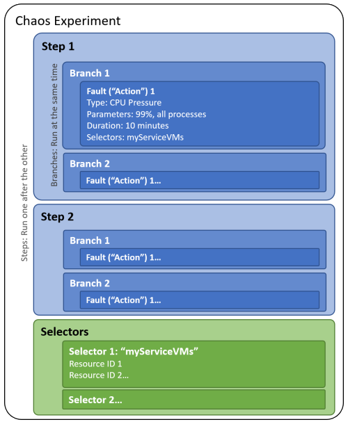

# Was ist Azure Chaos Studio (Vorschauversion)?

Azure Chaos Studio ist ein verwalteter Dienst zur Verbesserung der Resilienz durch Einschleusung von Fehlern in Ihre Azure-Anwendungen. Die Durchführung kontrollierter Fehlereinschleusungsexperimente (sogenanntes Chaos Engineering) trägt dazu bei, die Resilienz für reale Vorfälle wie etwa Regionsausfälle oder Anwendungsfehler, die auf einem virtuellen Computer eine hohe CPU-Auslastung verursachen, zu messen, nachzuvollziehen und zu verbessern.

> [!VIDEO https://channel9.msdn.com/Shows/Azure-Videos/Azure-Chaos-Studio-Curious-to-control-chaos/player]

## Gründe für die Verwendung von Chaos Studio

Die Überprüfung und Verbesserung der Resilienz einer Anwendung ist immer ein wichtiger Punkt – ganz gleich, ob Sie eine neue Anwendung entwickeln, die in Azure gehostet wird, eine vorhandene Anwendung zu Azure migrieren oder eine Anwendung verwenden, die bereits in Azure ausgeführt wird. Resilienz ist die Fähigkeit eines Systems, mit Störungen umzugehen und sich von Störungen zu erholen. Eine Beeinträchtigung der Verfügbarkeit Ihrer Anwendung kann zu Fehlern und Ausfällen für Benutzer führen, was wiederum negative Auswirkungen auf Ihr Unternehmen oder Ihre Mission haben kann.

Wenn Sie eine Anwendung in der Cloud ausführen, müssen Sie sich zur Vermeidung dieser negativen Folgen vergewissern, dass Ihre Anwendung effektiv auf Störungen reagiert. Solche Störungen können durch einen Dienst, von dem Sie abhängig sind, durch einen Ausfall des eigentlichen Diensts und sogar durch Tools und Prozesse für die Reaktion auf Vorfälle verursacht werden. Mithilfe von Chaos-Experimenten können Sie die Ausfallsicherheit Ihrer in der Cloud gehosteten Anwendung testen.

## Wann kann ich Chaos Studio verwenden?

Chaos Engineering kann für eine Vielzahl von Resilienzvalidierungsszenarien verwendet werden. Diese Szenarien decken den gesamten Lebenszyklus der Dienstentwicklung und des Betriebs ab und können entweder als *Shift-Right* (Verlagerung nach rechts) oder als *Shift-Left* (Verlagerung nach links) kategorisiert werden. Bei der Verlagerung nach rechts wird das Szenario am besten in einer Produktions- oder Präproduktionsumgebung überprüft. Bei der Verlagerung nach links kann das Szenario in einer Entwicklungsumgebung oder in einer gemeinsam genutzten Testumgebung überprüft werden. Shift-Right-Szenarien sollten in der Regel mit echtem Kundendatenverkehr oder simulierter Last durchgeführt werden, während bei Shift-Left-Szenarien kein echter Kundendatenverkehr erforderlich ist. Im Anschluss finden Sie einige gängige Szenarien für Chaos Engineering:
* Reproduzieren eines Vorfalls, der Ihre Anwendung beeinträchtigt hat, um den Fehlermodus besser zu verstehen oder sicherzustellen, dass nach dem Vorfall vorgenommene Korrekturen eine Wiederholung des Vorfalls verhindern
* Ausführen von Game Days zur Überprüfung der Auslastung, Skalierung, Leistung und Resilienz eines Diensts zur Vorbereitung auf ein größeres Benutzerereignis oder eine wichtige Phase
* Durchführen von BCDR-Drills (Business Continuity & Disaster Recovery), um sicherzustellen, dass Ihre Anwendung im Falle eines schwerwiegenden Zwischenfalls schnell wiederhergestellt werden kann und wichtige Daten erhalten bleiben
* Durchführen von Hochverfügbarkeitstests, um die Anwendungsresilienz bei bestimmten Fehlern wie Regionsausfällen, Netzwerkkonfigurationsfehlern, Ereignissen mit hoher Auslastung oder Noisy Neighbor-Problemen zu testen
* Entwickeln von Leistungsbenchmarks für Anwendungen
* Planen des Kapazitätsbedarfs für Produktionsumgebungen
* Ausführen von Belastungs- oder Auslastungstests
* Sicherstellen, dass Dienste, die aus einer lokalen Umgebung oder aus einer anderen Cloudumgebung migriert wurden, weiterhin gegenüber bekannten Fehlern resilient sind
* Schaffen von Vertrauen in Dienste, die auf cloudnativen Architekturen basieren
* Vergewissern, dass Livewebsite-Tools, Einblickdaten und Bereitschaftsprozesse unter unerwarteten Bedingungen wie erwartet funktionieren

In vielen dieser Szenarien verwenden Sie zunächst Ad-hoc-Chaos-Experimente, um für Resilienz zu sorgen, und vergewissern sich dann kontinuierlich, dass sich die Resilienz durch neue Bereitstellungen nicht verschlechtert, indem Sie Chaos-Experimente als Bereitstellungsgate in Ihrer CI/CD-Pipeline verwenden.

## Funktionsweise von Chaos Studio

Mit Chaos Studio können Sie die Einschleusung von Fehlern in Ihre Azure-Ressourcen sicher und kontrolliert orchestrieren. Das Herzstück von Chaos Studio sind Chaos-Experimente. Ein Chaos-Experiment ist eine Azure-Ressource, die die Fehler beschreibt, die ausgeführt werden sollen, und die Ressourcen, für die diese Fehler ausgeführt werden sollen. Fehler können je nach Ihren Anforderungen parallel oder nacheinander ausgeführt werden. Chaos Studio unterstützt zwei Arten von Fehlern: Fehler vom Typ *Service-direkt* werden direkt für eine Azure-Ressource ausgeführt, ohne dass eine Installation oder Instrumentierung (beispielsweise Neustarten eines Azure Cache for Redis-Clusters oder Hinzufügen von Netzwerklatenz zu AKS-Pods) erforderlich ist. Fehler vom Typ *Agent-basiert* werden dagegen auf virtuellen Computern oder in VM-Skalierungsgruppen ausgeführt, um gastinterne Fehler zu verursachen (beispielsweise durch Auslastung des virtuellen Arbeitsspeichers oder Beenden eines Prozesses). Für jeden Fehler können bestimmte Parameter konfiguriert werden – etwa, welcher Prozess beendet oder wie viel Arbeitsspeicherauslastung generiert werden soll.

Wenn Sie ein Chaos-Experiment erstellen, definieren Sie einen einzelnen Schritt oder mehrere nacheinander ausgeführte *Schritte*. Jeder Schritt enthält mindestens eine *Verzweigung*. Mehrere Verzweigungen werden parallel innerhalb des jeweiligen Schritts ausgeführt, und die einzelnen Verzweigungen enthalten wiederum mindestens eine *Aktion* wie etwa das Einschleusen eines Fehlers oder eine bestimmte Wartedauer. Abschließend strukturieren Sie die Ressourcen (*Ziele*), für die die einzelnen Fehler ausgeführt werden, in Gruppen (sogenannte Selektoren), um in jeder Aktion problemlos auf eine Gruppe von Ressourcen verweisen zu können.

Ein Chaos-Experiment ist eine Azure-Ressource, die sich in einem Abonnement und in einer Ressourcengruppe befindet. Sie können das Azure-Portal oder die Chaos Studio-REST-API verwenden, um ein Experiment zu erstellen, zu aktualisieren, zu starten, abzubrechen und dessen Status anzuzeigen.

## Nächste Schritte
Nutzen Sie die folgenden Links, um mit der Erstellung und Ausführung von Chaos-Experimenten zu beginnen und die Anwendungsresilienz mit Chaos Studio zu verbessern.
- [Erstellen und Ausführen des ersten Experiments](chaos-studio-tutorial-service-direct-portal.md)
- [Grundlegendes zu Chaos Engineering und Resilienz](chaos-studio-chaos-engineering-overview.md)
