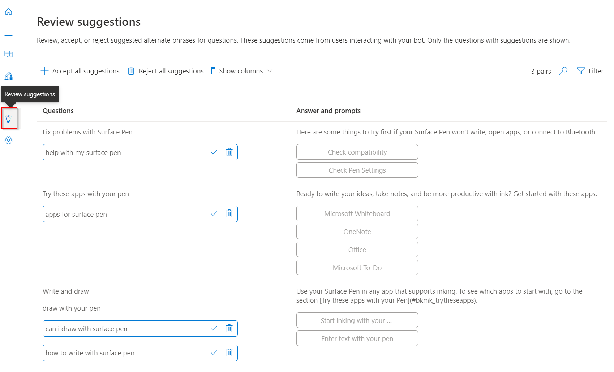

# <a name="enrich-your-project-with-active-learning"></a>Erweitern Ihres Projekts durch aktives Lernen

In diesem Tutorial lernen Sie Folgendes:

<!-- green checkmark -->
> [!div class="checklist"]
> * Herunterladen einer Testdatei für aktives Lernen
> * Importieren der Testdatei in Ihr vorhandenes Projekt
> * Akzeptieren/Ablehnen von Vorschlägen durch aktives Lernen
> * Hinzufügen alternativer Fragen

In diesem Tutorial erfahren Sie, wie Sie Ihr Fragen und Antworten-Projekt durch aktives Lernen erweitern. Das kann beispielsweise nötig sein, wenn Ihre Kunden Fragen stellen, die nicht Teil Ihres Projekts sind. Von vielen Fragen gibt es unterschiedlich formulierte Varianten.

Wenn diese Varianten als Alternativfragen zum entsprechenden Frage-Antwort-Paar hinzugefügt werden, kann das Projekt für die Beantwortung echter Benutzerfragen optimiert werden. Sie können Alternativfragen manuell über den Editor zu Frage-Antwort-Paaren hinzufügen. Sie können auch das Feature für aktives Lernen verwenden, um Vorschläge zu generieren, die auf Benutzerfragen basieren. Für das aktive Lernen ist es jedoch notwendig, dass die Wissensdatenbank regelmäßig Benutzerdatenverkehr empfängt, damit Vorschläge generiert werden können.

## <a name="enable-active-learning"></a>Aktivieren des aktiven Lernens

Aktives Lernen ist für Ressourcen, für die „Fragen und Antworten“ aktiviert ist, standardmäßig aktiviert.

Importieren Sie die Datei [SampleActiveLearning.tsv](https://github.com/Azure-Samples/cognitive-services-sample-data-files/blob/master/qna-maker/knowledge-bases/SampleActiveLearning.tsv) als neues Projekt, um die Vorschläge durch aktives Lernen zu testen.

## <a name="download-file"></a>Herunterladen der Datei

Führen Sie den folgenden Befehl an der Eingabeaufforderung aus, um eine lokale Kopie der Datei `SampleActiveLearning.tsv` herunterzuladen.

```cmd
curl "https://github.com/Azure-Samples/cognitive-services-sample-data-files/blob/master/qna-maker/knowledge-bases/SampleActiveLearning.tsv" --output SampleActiveLearning.tsv
```

## <a name="import-file"></a>Importieren einer Datei

Wählen Sie im Bereich „Wissensdatenbank bearbeiten“ für Ihr Projekt das Symbol `...` (Auslassungszeichen) im Menü, **Fragen und Antworten importieren** > **Als TSV importieren** aus. Wählen Sie **Datei auswählen** aus, um zu der Kopie von `SampleActiveLearning.tsv` zu navigieren, die Sie im vorherigen Schritt auf Ihren Computer heruntergeladen haben, und wählen Sie dann „Fertig“ aus.

> [!div class="mx-imgBorder"]
> [  ]( ../media/active-learning/import-questions.png#lightbox)

## <a name="view-and-addreject-active-learning-suggestions"></a>Anzeigen und Hinzufügen/Ablehnen von Vorschlägen durch aktives Lernen

Nachdem die Testdatei importiert wurde, können Vorschläge durch aktives Lernen im Bereich „Vorschläge überprüfen“ angezeigt werden:

> [!div class="mx-imgBorder"]
> [  ]( ../media/active-learning/review-suggestions.png#lightbox)

Wir können diese Vorschläge jetzt über die Optionen **Alle Vorschläge akzeptieren** oder **Alle Vorschläge ablehnen** in der Menüleiste entweder akzeptieren oder ablehnen.

Um einzelne Vorschläge zu akzeptieren oder abzulehnen, können Sie alternativ das Häkchensymbol (akzeptieren) oder das Papierkorbsymbol (ablehnen) auswählen, die neben den einzelnen Fragen auf der Seite **Vorschläge überprüfen** angezeigt werden.

> [!div class="mx-imgBorder"]
> [  ]( ../media/active-learning/accept-reject.png#lightbox)

## <a name="add-alternate-questions"></a>Hinzufügen alternativer Fragen

Während das aktive Lernen automatisch alternative Fragen basierend auf den Benutzerabfragen vorschlägt, die an das Projekt gerichtet sind, können wir auch Variationen einer Frage auf der Seite „Wissensdatenbank bearbeiten“ hinzufügen, indem wir **Alternativen Ausdruck hinzufügen** für Frage-Antwort-Paare auswählen.

Wenn Sie zusätzlich zum aktiven Lernen Alternativfragen hinzufügen, wird das Projekt durch Fragenvarianten erweitert, damit Benutzerfragen einheitlich beantwortet werden.

> [!NOTE]
> Wenn Alternativfragen viele Stoppwörter enthalten, können sie sich u. U. negativ auf die Genauigkeit der Antworten auswirken. Wenn der Unterschied bei den Alternativfragen nur in diesen Stoppwörtern besteht, sind keine Alternativfragen notwendig.
> Eine Liste der Stoppwörter finden Sie im [Artikel zu Stoppwörtern](https://github.com/Azure-Samples/azure-search-sample-data/blob/master/STOPWORDS.md).

## <a name="next-steps"></a>Nächste Schritte

> [!div class="nextstepaction"]
> [Verbessern der Antwortqualität mit Synonymen](adding-synonyms.md)
