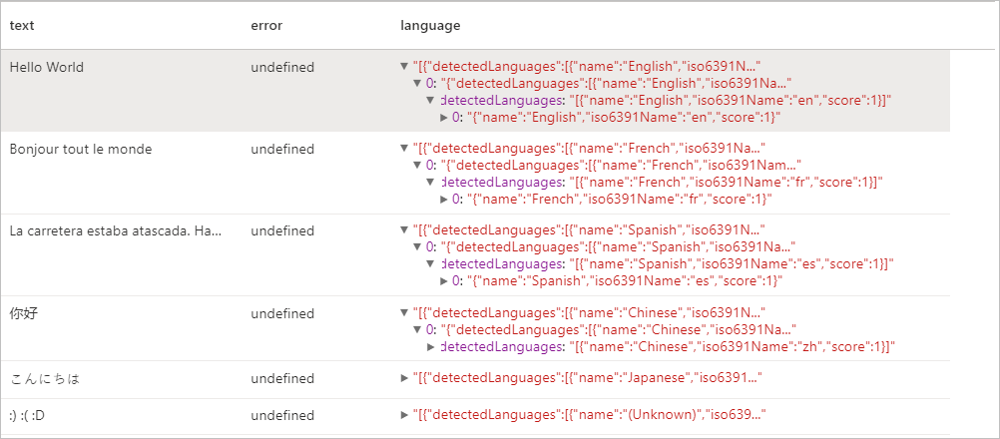
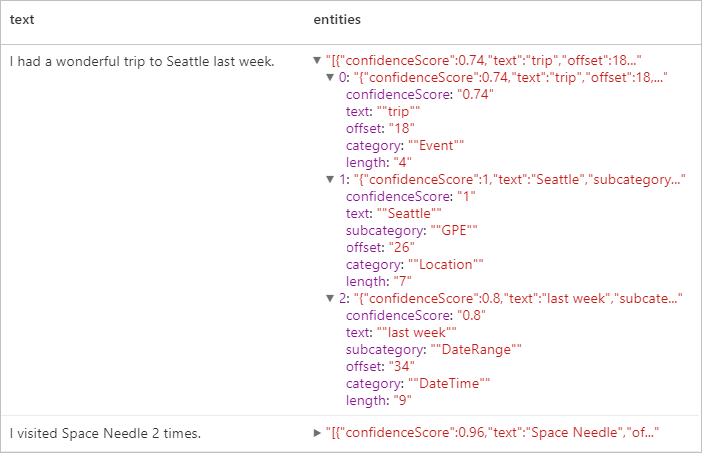

# <a name="tutorial-text-analytics-with-cognitive-service"></a>Tutorial: Textanalyse mit Cognitive Services

Die [Textanalyse](../../cognitive-services/text-analytics/index.yml) ist ein [Azure Cognitive Services](../../cognitive-services/index.yml)-Dienst, mit dem Sie Textmining und Textanalysen mit NLP-Features (Natural Language Processing) durchführen können. In diesem Tutorial erfahren Sie, wie Sie die [Textanalyse](../../cognitive-services/text-analytics/index.yml) verwenden, um unstrukturierten Text mithilfe von Azure Synapse Analytics zu analysieren.

Dieses Tutorial veranschaulicht die Verwendung der Textanalyse mit [SynapseML](https://github.com/microsoft/SynapseML) für Folgendes:

> [!div class="checklist"]
> - Erkennen von Stimmungsbezeichnungen auf Satz- oder Dokumentebene
> - Identifizieren der Sprache für eine bestimmte Texteingabe
> - Erkennen von Entitäten in einem Text mit Links zu einer bekannten Wissensdatenbank
> - Extrahieren von Schlüsselbegriffen aus einem Text
> - Identifizieren verschiedener Entitäten im Text und Kategorisieren dieser in vordefinierte Klassen oder Typen
> - Identifizieren und Ändern vertraulicher Entitäten in einem bestimmten Text

Wenn Sie kein Azure-Abonnement besitzen, können Sie ein [kostenloses Konto](https://azure.microsoft.com/free/) erstellen, bevor Sie beginnen.

## <a name="prerequisites"></a>Voraussetzungen

- [Azure Synapse Analytics-Arbeitsbereich](../get-started-create-workspace.md) mit einem als Standardspeicher konfigurierten Azure Data Lake Storage Gen2-Speicherkonto. Für das hier verwendete Data Lake Storage Gen2-Dateisystem müssen Sie über die Rolle *Mitwirkender an Storage-Blobdaten* verfügen.
- Spark-Pool in Ihrem Azure Synapse Analytics-Arbeitsbereich. Ausführliche Informationen finden Sie unter [Erstellen eines Spark-Pools in Azure Synapse](../quickstart-create-sql-pool-studio.md).
- Vorkonfigurationsschritte im Tutorial [Konfigurieren von Cognitive Services in Azure Synapse](tutorial-configure-cognitive-services-synapse.md)


## <a name="get-started"></a>Erste Schritte
Öffnen Sie Synapse Studio, und erstellen Sie ein neues Notebook. Importieren Sie zunächst [SynapseML](https://github.com/microsoft/SynapseML). 

```python
import synapse.ml
from synapse.ml.cognitive import *
from pyspark.sql.functions import col
```

## <a name="configure-text-analytics"></a>Konfigurieren der Textanalyse

Verwenden Sie die verknüpfte Textanalyse, die Sie in den [Vorbereitungsschritten](tutorial-configure-cognitive-services-synapse.md) konfiguriert haben. 

```python
cognitive_service_name = "<Your linked service for text analytics>"
```

## <a name="text-sentiment"></a>Stimmung in Text
Die Analyse der Stimmung im Text bietet eine Möglichkeit, Stimmungsbezeichnungen (z. B. „negativ“, „neutral“ und „positiv“) und Zuverlässigkeitsbewertungen auf Satz- und Dokumentebene zu erkennen. Eine Liste der unterstützten Sprachen finden Sie unter [Unterstützte Sprachen in der Textanalyse-API](../../cognitive-services/text-analytics/language-support.md?tabs=sentiment-analysis).

### <a name="v2"></a>V2

```python

# Create a dataframe that's tied to it's column names
df = spark.createDataFrame([
  ("I am so happy today, its sunny!", "en-US"),
  ("I am frustrated by this rush hour traffic", "en-US"),
  ("The cognitive services on spark aint bad", "en-US"),
], ["text", "language"])

# Run the Text Analytics service with options
sentimentv2 = (TextSentimentV2()
    .setLinkedService(linked_service_name)
    .setTextCol("text")
    .setOutputCol("sentiment")
    .setErrorCol("error")
    .setLanguageCol("language"))

# Show the results of your text query in a table format
display(sentimentv2.transform(df).select("text", col("sentiment")[0].getItem("score").alias("positive score")))

```
### <a name="expected-results"></a>Erwartete Ergebnisse

|text|Positive Bewertung|
|---|---|
|Ich bin heute so glücklich, die Sonne scheint!|0,99511755|
|Ich bin frustriert über diesen Berufsverkehr.|0,007274598|
|Cognitive Services in Spark sind gar nicht schlecht|0,9144157|

### <a name="v31"></a>V3.1

```python

# Create a dataframe that's tied to it's column names
df = spark.createDataFrame([
  ("I am so happy today, its sunny!", "en-US"),
  ("I am frustrated by this rush hour traffic", "en-US"),
  ("The cognitive services on spark aint bad", "en-US"),
], ["text", "language"])

# Run the Text Analytics service with options
sentiment = (TextSentiment()
    .setLinkedService(linked_service_name)
    .setTextCol("text")
    .setOutputCol("sentiment")
    .setErrorCol("error")
    .setLanguageCol("language"))

# Show the results of your text query in a table format
display(sentiment.transform(df).select("text", col("sentiment")[0].getItem("sentiment").alias("sentiment")))

```
### <a name="expected-results"></a>Erwartete Ergebnisse

|text|Stimmung|
|---|---|
|Ich bin heute so glücklich, die Sonne scheint!|Positiv|
|Ich bin frustriert über diesen Berufsverkehr.|Negativ|
|Cognitive Services in Spark sind gar nicht schlecht|Positiv|

---

## <a name="language-detector"></a>Spracherkennung

Die Sprachenerkennung wertet Texteingaben aus und gibt für jedes Dokument Sprachen-IDs mit einer Bewertung zurück, die die Stärke der Analyse angibt. Diese Funktion ist hilfreich für Inhaltsspeicher, die willkürliche Texte mit unbekannter Sprache sammeln. Eine Liste der unterstützten Sprachen finden Sie unter [Unterstützte Sprachen in der Textanalyse-API](../../cognitive-services/text-analytics/language-support.md?tabs=language-detection).

### <a name="v2"></a>V2
```python
# Create a dataframe that's tied to it's column names
df = spark.createDataFrame([
  ("Hello World",),
  ("Bonjour tout le monde",),
  ("La carretera estaba atascada. Había mucho tráfico el día de ayer.",),
  ("你好",),
  ("こんにちは",),
  (":) :( :D",)
], ["text",])

# Run the Text Analytics service with options
languagev2 = (LanguageDetectorV2()
    .setLinkedService(linked_service_name)
    .setTextCol("text")
    .setOutputCol("language")
    .setErrorCol("error"))

# Show the results of your text query in a table format
display(languagev2.transform(df))
```
### <a name="expected-results"></a>Erwartete Ergebnisse


### <a name="v31"></a>V3.1
```python
# Create a dataframe that's tied to it's column names
df = spark.createDataFrame([
  ("Hello World",),
  ("Bonjour tout le monde",),
  ("La carretera estaba atascada. Había mucho tráfico el día de ayer.",),
  ("你好",),
  ("こんにちは",),
  (":) :( :D",)
], ["text",])

# Run the Text Analytics service with options
language = (LanguageDetector()
    .setLinkedService(linked_service_name)
    .setTextCol("text")
    .setOutputCol("language")
    .setErrorCol("error"))

# Show the results of your text query in a table format
display(language.transform(df))
```
### <a name="expected-results"></a>Erwartete Ergebnisse
<a name="expected-results-for-language-detector-v31"></a>
---

## <a name="entity-detector"></a>Entitätserkennung
Die Entitätserkennung gibt eine Liste der erkannten Entitäten mit Links zu einer bekannten Wissensdatenbank zurück. Eine Liste der unterstützten Sprachen finden Sie unter [Unterstützte Sprachen in der Textanalyse-API](../../cognitive-services/text-analytics/language-support.md?tabs=entity-linking).

### <a name="v2"></a>V2

```python
df = spark.createDataFrame([
    ("1", "Microsoft released Windows 10"),
    ("2", "In 1975, Bill Gates III and Paul Allen founded the company.")
], ["if", "text"])

entityv2 = (EntityDetectorV2()
    .setLinkedService(linked_service_name)
    .setLanguage("en")
    .setOutputCol("replies")
    .setErrorCol("error"))

display(entityv2.transform(df).select("if", "text", col("replies")[0].getItem("entities").alias("entities")))
```
### <a name="expected-results"></a>Erwartete Ergebnisse


### <a name="v31"></a>V3.1

```python
df = spark.createDataFrame([
    ("1", "Microsoft released Windows 10"),
    ("2", "In 1975, Bill Gates III and Paul Allen founded the company.")
], ["if", "text"])

entity = (EntityDetector()
    .setLinkedService(linked_service_name)
    .setLanguage("en")
    .setOutputCol("replies")
    .setErrorCol("error"))

display(entity.transform(df).select("if", "text", col("replies")[0].getItem("entities").alias("entities")))
```
### <a name="expected-results"></a>Erwartete Ergebnisse


---

## <a name="key-phrase-extractor"></a>Schlüsselbegriffserkennung

Die Schlüsselbegriffserkennung bewertet unstrukturierten Text und gibt eine Liste mit Schlüsselbegriffen zurück. Diese Funktion ist nützlich, wenn Sie die wichtigsten Punkte in einer Sammlung von Dokumenten schnell identifizieren müssen. Eine Liste der unterstützten Sprachen finden Sie unter [Unterstützte Sprachen in der Textanalyse-API](../../cognitive-services/text-analytics/language-support.md?tabs=key-phrase-extraction).

### <a name="v2"></a>V2
```python
df = spark.createDataFrame([
    ("en", "Hello world. This is some input text that I love."),
    ("fr", "Bonjour tout le monde"),
    ("es", "La carretera estaba atascada. Había mucho tráfico el día de ayer.")
], ["lang", "text"])

keyPhrasesv2 = (KeyPhraseExtractorV2()
    .setLinkedService(linked_service_name)
    .setLanguageCol("lang")
    .setOutputCol("replies")
    .setErrorCol("error"))

display(keyPhrasesv2.transform(df).select("text", col("replies")[0].getItem("keyPhrases").alias("keyPhrases")))
```

### <a name="expected-results"></a>Erwartete Ergebnisse

|text|keyPhrases|
|---|---|
|Hello World. This is some input text that I love.|"["input text","world"]"|
|Bonjour tout le monde|"["monde"]"|
|La carretera estaba atascada. Había mucho tráfico el día de ayer.|"["carretera","tráfico","día"]"|


### <a name="v31"></a>V3.1

```python
df = spark.createDataFrame([
    ("en", "Hello world. This is some input text that I love."),
    ("fr", "Bonjour tout le monde"),
    ("es", "La carretera estaba atascada. Había mucho tráfico el día de ayer.")
], ["lang", "text"])

keyPhrase = (KeyPhraseExtractor()
    .setLinkedService(linked_service_name)
    .setLanguageCol("lang")
    .setOutputCol("replies")
    .setErrorCol("error"))

display(keyPhrase.transform(df).select("text", col("replies")[0].getItem("keyPhrases").alias("keyPhrases")))
```

### <a name="expected-results"></a>Erwartete Ergebnisse

|text|keyPhrases|
|---|---|
|Hello World. This is some input text that I love.|"["Hello world","input text"]"|
|Bonjour tout le monde|"["Bonjour","monde"]"|
|La carretera estaba atascada. Había mucho tráfico el día de ayer.|"["mucho tráfico","día","carretera","ayer"]"|

---

## <a name="named-entity-recognition-ner"></a>Erkennung benannter Entitäten (NER)

NER (Named Entity Recognition) ist die Möglichkeit, unterschiedliche Entitäten im Text zu identifizieren und sie in vordefinierte Klassen oder Typen zu kategorisieren wie z. B.: „Person“, „Standort“, „Ereignis“, „Produkt“ und „Organisation“. Eine Liste der unterstützten Sprachen finden Sie unter [Unterstützte Sprachen in der Textanalyse-API](../../cognitive-services/text-analytics/language-support.md?tabs=named-entity-recognition).

### <a name="v2"></a>V2
```python
df = spark.createDataFrame([
    ("1", "en", "I had a wonderful trip to Seattle last week."),
    ("2", "en", "I visited Space Needle 2 times.")
], ["id", "language", "text"])

nerv2 = (NERV2()
    .setLinkedService(linked_service_name)
    .setLanguageCol("language")
    .setOutputCol("replies")
    .setErrorCol("error"))

display(nerv2.transform(df).select("text", col("replies")[0].getItem("entities").alias("entities")))
```
### <a name="expected-results"></a>Erwartete Ergebnisse


### <a name="v31"></a>V3.1

```python
df = spark.createDataFrame([
    ("1", "en", "I had a wonderful trip to Seattle last week."),
    ("2", "en", "I visited Space Needle 2 times.")
], ["id", "language", "text"])

ner = (NER()
    .setLinkedService(linked_service_name)
    .setLanguageCol("language")
    .setOutputCol("replies")
    .setErrorCol("error"))

display(ner.transform(df).select("text", col("replies")[0].getItem("entities").alias("entities")))
```
### <a name="expected-results"></a>Erwartete Ergebnisse


---

## <a name="personally-identifiable-information-pii-v31"></a>Personenbezogene Informationen (Personally Identifiable Information, PII v3.1)
Das Feature PII ist ein Bestandteil von NER und kann vertrauliche Entitäten in Text identifizieren und bearbeiten, die einer einzelnen Person zugeordnet sind, wie z. B.: Telefonnummer, E-Mail-Adresse, Postanschrift, Reisepassnummer. Eine Liste der unterstützten Sprachen finden Sie unter [Unterstützte Sprachen in der Textanalyse-API](../../cognitive-services/text-analytics/language-support.md?tabs=pii).

### <a name="v31"></a>V3.1

```python
df = spark.createDataFrame([
    ("1", "en", "My SSN is 859-98-0987"),
    ("2", "en", "Your ABA number - 111000025 - is the first 9 digits in the lower left hand corner of your personal check."),
    ("3", "en", "Is 998.214.865-68 your Brazilian CPF number?")
], ["id", "language", "text"])

pii = (PII()
    .setLinkedService(linked_service_name)
    .setLanguageCol("language")
    .setOutputCol("replies")
    .setErrorCol("error"))

display(pii.transform(df).select("text", col("replies")[0].getItem("entities").alias("entities")))
```
### <a name="expected-results"></a>Erwartete Ergebnisse


---

## <a name="clean-up-resources"></a>Bereinigen von Ressourcen
Beenden Sie alle verbundenen Sitzungen (Notebooks), um sicherzustellen, dass die Spark-Instanz heruntergefahren wird. Der Pool wird heruntergefahren, wenn die im Apache Spark-Pool angegebene **Leerlaufzeit** erreicht wird. Sie können auch auf der Statusleiste am oberen Rand des Notebooks die Option **Sitzung beenden** auswählen.


## <a name="next-steps"></a>Nächste Schritte

* [Beispiele für Synapse-Notebooks](https://github.com/Azure-Samples/Synapse/tree/main/MachineLearning) 
* [SynapseML-GitHub-Repository](https://github.com/microsoft/SynapseML)
