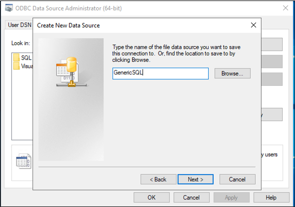
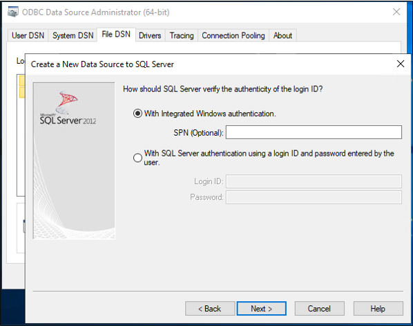
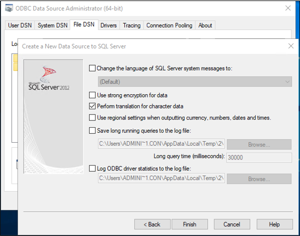
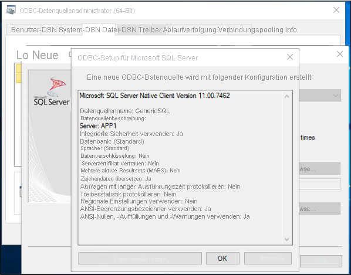
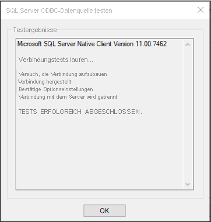
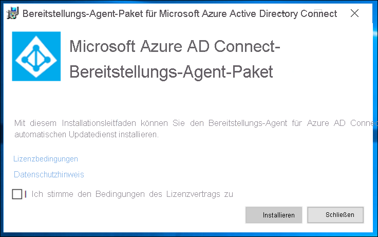
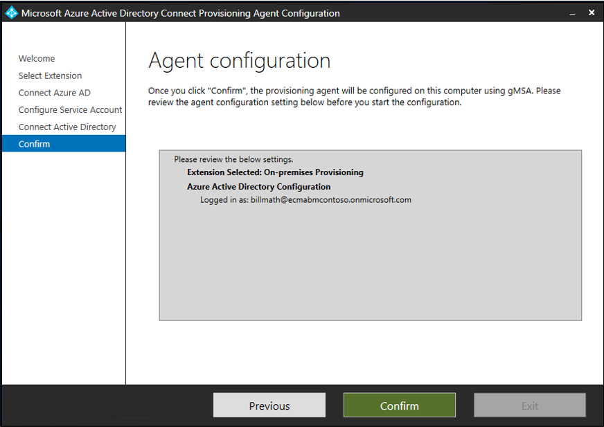

In diesem Dokument werden die Schritte beschrieben, die Sie ausführen müssen, um Benutzer aus Azure Active Directory (Azure AD) automatisch in einer SQL-Datenbank bereitzustellen und deren Bereitstellungen wieder aufzuheben.  
 
Wichtige Details zum Zweck und zur Funktionsweise dieses Diensts sowie häufig gestellte Fragen finden Sie unter [Automatisieren der Bereitstellung und Bereitstellungsaufhebung von Benutzern für SaaS-Anwendungen mit Azure Active Directory](../articles/active-directory/app-provisioning/user-provisioning.md).

## <a name="prerequisites-for-provisioning-to-a-sql-database"></a>Voraussetzungen für die Bereitstellung für eine SQL-Datenbank

>[!IMPORTANT]
> Die Vorschauversion zur lokalen Bereitstellung ist derzeit nur mit Einladung verfügbar. Um Zugriff auf die Funktion anzufordern, verwenden Sie das [Zugriffsanforderungsformular](https://aka.ms/onpremprovisioningpublicpreviewaccess). Wir öffnen die Vorschauversion im Rahmen der Vorbereitung auf die allgemeine Verfügbarkeit in den nächsten Monaten für weitere Kunden und Connectors.


### <a name="on-premises-prerequisites"></a>Lokale Voraussetzungen

 - Ein Zielsystem, z. B. eine SQL-Datenbank, in dem Benutzer erstellt, aktualisiert und gelöscht werden können.
 - Ein Computer mit Windows Server 2016 oder höher, einer über das Internet zugänglichen TCP/IP-Adresse, Konnektivität mit dem Zielsystem und ausgehender Konnektivität mit login.microsoftonline.com. Ein Beispiel ist eine Windows Server 2016-VM, die in Azure IaaS oder hinter einem Proxy gehostet wird. Der Server sollte über mindestens 3 GB RAM verfügen.
 - Ein Computer mit .NET Framework 4.7.1

Je nachdem, welche Optionen Sie auswählen, sind einige Bildschirme des Assistenten möglicherweise nicht verfügbar, und die Informationen können sich geringfügig unterscheiden. Für die Zwecke dieser Konfiguration wird der Objekttyp „Benutzer“ verwendet. Die folgenden Informationen können Ihnen bei der Konfiguration nützlich sein. 

#### <a name="supported-systems"></a>Unterstützte Systeme
* Microsoft SQL Server und Azure SQL
* IBM DB2 10.x
* IBM DB2 9.x
* Oracle 10 und 11g
* Oracle 12c und 18c
* MySQL 5.x

Hinweis: Für den generischen SQL-Connector muss bei Spaltennamen die Groß-/Kleinschreibung nicht beachtet werden. Bei MySQL muss die Groß-/Kleinschreibung unter Linux und bei Postgres plattformübergreifend beachtet werden. Daher werden diese Systeme derzeit nicht unterstützt. 

### <a name="cloud-requirements"></a>Cloudanforderungen

 - Ein Azure AD-Mandant mit Azure AD Premium P1 oder Premium P2 (oder EMS E3 oder E5). 
 
    [!INCLUDE [active-directory-p1-license.md](active-directory-p1-license.md)]
 - Die Rolle „Hybridadministrator“ zum Konfigurieren des Bereitstellungs-Agents und die Rollen „Anwendungsadministrator“ oder „Cloudadministrator“ zum Konfigurieren der Bereitstellung im Azure-Portal.

## <a name="prepare-the-sample-database"></a>Vorbereiten der Beispieldatenbank
Führen Sie auf einem Server, auf dem SQL Server ausgeführt wird, das SQL Skript in [Anhang A](#appendix-a) aus. Dieses Skript erstellt eine Beispieldatenbank mit dem Namen „CONTOSO“. Dies ist die Datenbank, in der Sie Benutzer bereitstellen.


## <a name="create-the-dsn-connection-file"></a>Erstellen der DSN-Verbindungsdatei
Der generische SQL-Connector ist eine DSN-Datei zum Herstellen einer Verbindung mit dem SQL-Server. Zunächst müssen Sie eine Datei mit den ODBC-Verbindungsinformationen erstellen.

 1. Starten Sie das ODBC-Verwaltungshilfsprogramm auf Ihrem Server.
     </br>
 2. Wählen Sie die Registerkarte **Datei-DSN** und dann **Hinzufügen** aus. 
     </br>
 3. Wählen Sie **SQL Server Native Client 11.0** und dann **Weiter** aus. 
     </br>
 4. Geben Sie der Datei einen Namen, z. B. **GenericSQL**, und wählen Sie dann **Weiter** aus. 
     </br>
 5. Wählen Sie **Fertig stellen** aus. 
     </br>
 6. Konfigurieren Sie nun die Verbindung. Geben Sie als Namen des Servers **APP1** ein, und wählen Sie **Weiter** aus.
     </br>
 7. Behalten Sie die Windows-Authentifizierung bei, und wählen Sie **Weiter** aus.
     </br>
 8. Geben Sie den Namen der Beispieldatenbank ein, also **CONTOSO**.
     
 9. Behalten Sie auf diesem Bildschirm die Standardeinstellungen bei, und wählen Sie **Fertig stellen** aus.
     </br>
 10. Um zu überprüfen, ob alles wie erwartet funktioniert, wählen Sie **Datenquelle testen** aus. 
     </br>
 11. Überprüfen Sie, ob der Test erfolgreich war.
     </br>
 12. Wählen Sie zweimal **OK**. Schließen Sie den ODBC-Datenquellen-Administrator.


## <a name="download-install-and-configure-the-azure-ad-connect-provisioning-agent-package"></a>Herunterladen, Installieren und Konfigurieren des Azure AD Connect-Bereitstellungs-Agent-Pakets

 1. Melden Sie sich beim Azure-Portal an.
 2. Navigieren Sie zu **Unternehmensanwendungen** > **Neue Anwendung hinzufügen**.
 3. Suchen Sie nach der Anwendung **Lokale ECMA-App**, und fügen Sie Ihrem Mandantenimage die Anwendung hinzu.
 4. Wählen Sie die **lokale ECMA-App** aus, die hinzugefügt wurde.
 5. Wählen Sie unter **Erste Schritte** im Feld **3. Benutzerkonten bereitstellen** die Option **Erste Schritte** aus.
 6. Wählen Sie am oberen Rand **Bereitstellung bearbeiten** aus.
 7. Laden Sie unter **Lokale Konnektivität** das Agent-Installationsprogramm herunter.     
     >[!NOTE]
     >Verwenden Sie verschiedene Bereitstellungs-Agents für die lokale Anwendungsbereitstellung und die Azure AD Connect Cloudsynchronisierung/personengesteuerte Bereitstellung. Es sollten nicht alle drei Szenarien auf demselben Agent verwaltet werden. 
 8. Führen Sie das Installationsprogramm für den Azure AD Connect-Bereitstellungs-Agent **AADConnectProvisioningAgentSetup.msi** aus.
 9. Akzeptieren Sie auf dem Bildschirm **Microsoft Azure AD Connect-Bereitstellungs-Agent-Paket** die Lizenzbedingungen, und wählen Sie **Installieren** aus.
     </br>
 10. Nach Abschluss dieses Vorgangs wird der Konfigurations-Assistent gestartet. Klicken Sie auf **Weiter**.
     </br>
 11. Wählen Sie auf dem Bildschirm **Erweiterung auswählen** die Option **Lokale Anwendungsbereitstellung (Azure AD in Anwendung)** aus. Klicken Sie auf **Weiter**.
     </br>
 12. Verwenden Sie Ihr globales Administratorkonto, um sich bei Azure AD anzumelden.
     </br>
 13. Wählen Sie auf dem Bildschirm **Agent-Konfiguration** die Option **Bestätigen** aus.
     </br>
 14. Nach Abschluss der Installation sollte im unteren Bereich des Assistenten eine Meldung angezeigt werden. Wählen Sie **Beenden** aus.
     </br>
 15. Wechseln Sie zurück zum Azure-Portal unter die Anwendung **lokale ECMA-App** und zurück zu **Bereitstellung bearbeiten**.
 16. Ändern Sie auf der Seite **Bereitstellung** den Modus in **Automatisch**.
     </br>
 17. Wählen Sie im Abschnitt **Lokale Konnektivität** den Agent aus, den Sie gerade bereitgestellt haben, und wählen Sie dann **Agent(s) zuweisen** aus.
     </br>
     >[!NOTE]
     >Warten Sie nach dem Hinzufügen eines Agents 10 Minuten, bis die Registrierung abgeschlossen ist. Der Konnektivitätstest funktioniert erst, wenn die Registrierung abgeschlossen ist.
     >
     >Alternativ können Sie erzwingen, dass die Agent-Registrierung abgeschlossen wird, indem Sie den Bereitstellungs-Agent auf Ihrem Server neu starten. Navigieren Sie zu Ihrem Server, suchen Sie in der Windows-Suchleiste nach **Dienste** und dem **Bereitstellungs-Agent-Dienst von Azure AD Connect**, klicken Sie mit der rechten Maustaste auf den Dienst, und starten Sie ihn neu.

  
 ## <a name="configure-the-azure-ad-ecma-connector-host-certificate"></a>Konfigurieren des Azure AD-ECMA-Connectorhostzertifikats
 1. Wählen Sie auf dem Desktop die Verknüpfung „ECMA“ aus.
 2. Nachdem die Konfiguration des ECMA-Connectorhosts gestartet wurde, behalten Sie den Standardport **8585** bei, und wählen Sie **Generieren** aus, um ein Zertifikat zu generieren. Bei dem automatisch generierten Zertifikat handelt es sich um ein selbstsigniertes Zertifikat der vertrauenswürdigen Stammzertifizierungsstelle. Das SAN stimmt mit dem Hostnamen überein.
     
 3. Wählen Sie **Speichern** aus.

## <a name="create-a-generic-sql-connector"></a>Erstellen eines generischen SQL-Connectors
 1. Wählen Sie auf dem Desktop die Verknüpfung „ECMA-Connectorhost“ aus.
 2. Wählen Sie **Neuer Connector** aus.
     </br>
 3. Füllen Sie auf der Seite **Eigenschaften** die Felder mit den Werten aus, die in der Tabelle unter dem Bild angegeben sind, und wählen Sie **Weiter** aus.
     

     |Eigenschaft|Wert|
     |-----|-----|
     |Name|SQL|
     |Zeitgeber für automatische Synchronisierung (Minuten)|120|
     |Geheimes Token|Geben Sie hier Ihren eigenen Schlüssel ein. Er sollte mindestens 12 Zeichen lang sein.|
     |Erweiterungs-DLL|Wählen Sie für einen generischen SQL-Connector **Microsoft.IAM.Connector.GenericSql.dll** aus.|
4. Füllen Sie auf der Seite **Konnektivität** die Felder mit den Werten aus, die in der Tabelle unter dem Bild angegeben sind, und wählen Sie **Weiter** aus.
     </br>
     
     |Eigenschaft|BESCHREIBUNG|
     |-----|-----|
     |DSN-Datei|Die Datei mit dem Datenquellennamen, die zum Herstellen einer Verbindung mit der SQL Server-Instanz verwendet wird|
     |Benutzername|Der Benutzername einer Einzelperson mit Rechten für die SQL Server-Instanz. Dieser muss für eigenständige Server das Format „Hostname\Konto_des_SQL-Administrators“ und für Domänenmitgliedsserver das Format „Domäne\Konto_des_SQL-Administrators“ aufweisen.|
     |Kennwort|Das Kennwort des angegebenen Benutzernamens|
     |DN ist Anker|Sofern nicht bekannt ist, dass Ihre Umgebung diese Einstellungen erfordert, aktivieren Sie die Kontrollkästchen **DN ist Anker** und **Exporttyp:Objekt ersetzen** nicht.|
 5. Füllen Sie auf der Seite **Schema 1** die Felder mit den Werten aus, die in der Tabelle unter dem Bild angegeben sind, und wählen Sie **Weiter** aus.
     </br>

     |Eigenschaft|Wert|
     |-----|-----|
     |Erkennungsmethode für Objekttyp|Fixed Value (Fester Wert)|
     |Liste mit festem Wert/Tabelle/Sicht/SP (Stored Procedure, gespeicherte Prozedur)|Benutzer|
 6. Füllen Sie auf der Seite **Schema 2** die Felder mit den Werten aus, die in der Tabelle unter dem Bild angegeben sind, und wählen Sie **Weiter** aus.
     </br>
 
     |Eigenschaft|Wert|
     |-----|-----|
     |Benutzer:Attributerkennung|Tabelle|
     |Benutzer:Tabelle/Sicht/SP|Employees|
 7. Füllen Sie auf der Seite **Schema 3** die Felder mit den Werten aus, die in der Tabelle unter dem Bild angegeben sind, und wählen Sie **Weiter** aus.
     

     |Eigenschaft|Beschreibung|
     |-----|-----|
     |Anker für User auswählen|User:ContosoLogin|
     |DN-Attribut für Benutzer auswählen|AzureID|
8. Übernehmen Sie auf der Seite **Schema 4** die Standardeinstellungen, und wählen Sie **Weiter** aus.
     </br>
 9. Füllen Sie die Felder auf der Seite **Global** aus, und wählen Sie **Weiter** aus. In der Tabelle unter der Abbildung finden Sie Anweisungen für die einzelnen Felder.
     </br>
     
     |Eigenschaft|Beschreibung|
     |-----|-----|
     |Datum-/Uhrzeitformat der Datenquelle|yyyy-MM-dd HH:mm:ss|
 10. Wählen Sie auf der Seite **Partitionen** die Schaltfläche **Weiter** aus.
     </br>
 11. Behalten Sie auf der Seite **Ausführungsprofile** die Aktivierung des Kontrollkästchens **Export** bei. Aktivieren Sie das Kontrollkästchen **Vollständiger Import**, und wählen Sie **Weiter** aus.
     </br>
     
     |Eigenschaft|BESCHREIBUNG|
     |-----|-----|
     |Exportieren|Ausführungsprofil zum Exportieren von Daten in SQL. Dieses Ausführungsprofil ist erforderlich.|
     |Vollständiger Import|Ausführungsprofil zum Importieren aller Daten aus den zuvor angegebenen SQL-Quellen.|
     |Deltaimport|Ausführungsprofil, das nur Änderungen aus SQL seit dem letzten vollständigen oder Deltaimport importiert.|
 12. Füllen Sie die Felder auf der Seite **Export** aus, und wählen Sie **Weiter** aus. In der Tabelle unter der Abbildung finden Sie Anweisungen für die einzelnen Felder. 
     </br>
     
     |Eigenschaft|BESCHREIBUNG|
     |-----|-----|
     |Vorgangsmethode|Tabelle|
     |Tabelle/Sicht/SP|Employees|
 13. Füllen Sie die Felder auf der Seite **Vollständiger Import** aus, und wählen Sie **Weiter** aus. In der Tabelle unter der Abbildung finden Sie Anweisungen für die einzelnen Felder. 
     </br>
     
     |Eigenschaft|BESCHREIBUNG|
     |-----|-----|
     |Vorgangsmethode|Tabelle|
     |Tabelle/Sicht/SP|Employees|
 14. Füllen Sie die Felder auf der Seite **Objekttypen** aus, und wählen Sie **Weiter** aus. In der Tabelle unter der Abbildung finden Sie Anweisungen für die einzelnen Felder.   
      - **Anker:** Dieses Attribut muss im Zielsystem eindeutig sein. Der Azure AD-Bereitstellungsdienst fragt nach dem ersten Zyklus mithilfe dieses Attributs den ECMA-Host ab. Dieser Ankerwert muss mit dem Ankerwert in Schema 3 identisch sein.
      - **Abfrageattribut:** wird vom ECMA-Host zum Abfragen des In-Memory-Caches verwendet. Dieses Attribut muss eindeutig sein.
      - **DN:** In den meisten Fällen sollte die Option **Automatisch generiert** aktiviert werden. Falls sie deaktiviert ist, stellen Sie sicher, dass das DN-Attribut einem Attribut in Azure AD zugeordnet ist, das den DN in diesem Format speichert: CN = anchorValue, Object = objectType.  Weitere Informationen zu Ankern und dem DN finden Sie unter [Grundlegendes zu Ankerattributen und DNs (Distinguished Names)](../articles/active-directory/app-provisioning/on-premises-application-provisioning-architecture.md#about-anchor-attributes-and-distinguished-names).
     </br>
     
     |Eigenschaft|BESCHREIBUNG|
     |-----|-----|
     |Zielobjekt|Benutzer|
     |Anchor|ContosoLogin|
     |Abfrageattribut|AzureID|
     |DN|AzureID|
     |Automatisch generiert|Überprüft|      
 15. Der ECMA-Host erkennt die vom Zielsystem unterstützten Attribute. Sie können wählen, welches dieser Attribute Sie für Azure AD verfügbar machen möchten. Diese Attribute können dann im Azure-Portal zur Bereitstellung konfiguriert werden. Fügen Sie auf der Seite **Attribute auswählen** alle Attribute in der Dropdownliste hinzu, und wählen Sie **Weiter** aus. 
     </br>
      In der Dropdownliste **Attribut** werden alle Attribute angezeigt, die im Zielsystem gefunden wurden und *nicht* auf der vorherigen Seite **Attribute auswählen** ausgewählt wurden. 
 
 16. Wählen Sie auf der Seite **Bereitstellung aufheben** unter **Flow deaktivieren** die Option **Löschen** aus. Beachten Sie, dass auf der vorherigen Seite ausgewählte Attribute auf der Seite „Bereitstellung aufheben“ nicht zur Auswahl stehen. Wählen Sie **Fertig stellen** aus.
     </br>


## <a name="ensure-the-ecma2host-service-is-running"></a>Sicherstellen, dass der ECMA2Host-Dienst ausgeführt wird
 1. Wählen Sie auf dem Server, auf dem der Azure AD-ECMA-Connectorhost ausgeführt wird, **Starten** aus.
 2. Geben Sie **run** (Ausführen) und **services.msc** in das Feld ein.
 3. Stellen Sie sicher, dass **Microsoft ECMA2Host** in der in der Liste **Dienste** enthalten ist und ausgeführt wird. Wählen Sie andernfalls **Starten** aus.
     


## <a name="test-the-application-connection"></a>Testen der Verbindung zur Anwendung
 1. Melden Sie sich beim Azure-Portal an.
 2. Wechseln Sie zu **Unternehmensanwendungen** und der Anwendung **Lokale ECMA-App**.
 3. Wechseln Sie zu **Bereitstellung bearbeiten**.
 4. Geben Sie nach 10 Minuten im Abschnitt **Administratoranmeldeinformationen** die folgende URL ein. Ersetzen Sie den Teil `{connectorName}` durch den Namen des Connectors auf dem ECMA-Host. Sie können auch `localhost` durch den Hostnamen ersetzen.

 |Eigenschaft|Wert|
 |-----|-----|
 |Mandanten-URL|https://localhost:8585/ecma2host_{connectorName}/scim|
 
 5. Geben Sie den Wert des **geheimen Tokens** ein, das Sie beim Erstellen des Connectors definiert haben.
 6. Wählen Sie **Verbindung testen** aus, und warten Sie eine Minute.
     
 7. Wenn der Verbindungstest erfolgreich war, wählen Sie **Speichern** aus.</br>
     
## <a name="assign-users-to-an-application"></a>Zuweisen von Benutzern zu einer Anwendung
Da der Azure AD-ECMA-Connectorhost und Azure AD nun miteinander kommunizieren, können Sie mit der Konfiguration des Bereitstellungsbereichs fortfahren. 

 1. Wählen Sie im Azure-Portal die Option **Unternehmensanwendungen** aus.
 2. Wählen Sie die Anwendung **Lokale Bereitstellung** aus.
 3. Wählen Sie links unter **Verwalten** die Option **Benutzer und Gruppen** aus.
 4. Wählen Sie **Benutzer/Gruppe hinzufügen** aus.
     
5. Wählen Sie unter **Benutzer** die Option **Keine Elemente ausgewählt** aus.
     
 6. Wählen Sie auf der rechten Seite Benutzer und dann die Schaltfläche **Auswählen** aus.</br>
     
 7. Wählen Sie nun **Zuweisen** aus.
     

## <a name="configure-attribute-mappings"></a>Konfigurieren von Attributzuordnungen
Nun müssen Sie Attribute zwischen der lokalen Anwendung und Ihrem SQL-Server zuordnen.

#### <a name="configure-attribute-mapping"></a>Konfigurieren von Attributzuordnungen
 1. Wählen Sie im Azure AD-Portal unter **Unternehmensanwendungen** die Seite **Bereitstellung** aus.
 2. Klicken Sie auf **Get started** (Los geht‘s).
 3. Erweitern Sie **Zuordnungen**, und wählen Sie **Azure Active Directory-Benutzer bereitstellen** aus.
     </br>
4. Wählen Sie **Neue Zuordnung hinzufügen** aus.
     </br>
 5. Geben Sie die Quell- und Zielattribute an, und fügen Sie alle Zuordnungen in der folgenden Tabelle hinzu.
     </br>
     
     |Zuordnungstyp|Quellattribut|Zielattribut|
     |-----|-----|-----|
     |Direkt|userPrincipalName|urn:ietf:params:scim:schemas:extension:ECMA2Host:2.0:User:ContosoLogin|
     |Direkt|objectID|urn:ietf:params:scim:schemas:extension:ECMA2Host:2.0:User:AzureID|
     |Direkt|mail|urn:ietf:params:scim:schemas:extension:ECMA2Host:2.0:User:Email|
     |Direkt|givenName|urn:ietf:params:scim:schemas:extension:ECMA2Host:2.0:User:FirstName|
     |Direkt|surName|urn:ietf:params:scim:schemas:extension:ECMA2Host:2.0:User:LastName|
     |Direkt|mailNickname|urn:ietf:params:scim:schemas:extension:ECMA2Host:2.0:User:textID|
 
 6. Wählen Sie **Speichern** aus.
     
## <a name="test-provisioning"></a>Testen der Bereitstellung
Nachdem Ihre Attribute nun zugeordnet sind, können Sie die bedarfsorientierte Bereitstellung mit einem Ihrer Benutzer testen.
 
 1. Wählen Sie im Azure-Portal die Option **Unternehmensanwendungen** aus.
 2. Wählen Sie die Anwendung **Lokale Bereitstellung** aus.
 3. Wählen Sie links **Bereitstellung** aus.
 4. Klicken Sie auf **Bei Bedarf bereitstellen**.
 5. Suchen Sie nach einem Ihrer Testbenutzer, und wählen Sie **Bereitstellen** aus.
     

## <a name="start-provisioning-users"></a>Benutzerbereitstellung starten
 1. Nachdem die bedarfsorientierte Bereitstellung erfolgreich war, wechseln Sie zurück zur Konfigurationsseite der Bereitstellung. Stellen Sie sicher, dass der Bereich nur auf zugewiesene Benutzer und Gruppen festgelegt ist, aktivieren Sie die Bereitstellung (**On**), und wählen Sie **Speichern** aus.
 
    
2. Warten Sie einige Minuten, bis die Bereitstellung gestartet wurde. Dies kann bis zu 40 Minuten dauern. Nachdem der Bereitstellungsauftrag wie im nächsten Abschnitt beschrieben abgeschlossen wurde, können Sie den Bereitstellungsstatus wieder deaktivieren (**Off**) und **Speichern** auswählen. Durch diese Aktion wird der Bereitstellungsdienst in Zukunft nicht mehr ausgeführt.

## <a name="check-that-users-were-successfully-provisioned"></a>Überprüfen der erfolgreichen Bereitstellung von Benutzern
Kontrollieren Sie im Anschluss an die Wartezeit die SQL-Datenbank, um zu überprüfen, ob neue Benutzer bereitgestellt werden.

 

## <a name="appendix-a"></a>Anhang A
Verwenden Sie das folgende SQL-Skript, um die Beispieldatenbank zu erstellen.

```SQL
---Creating the Database---------
Create Database CONTOSO
Go
-------Using the Database-----------
Use [CONTOSO]
Go
-------------------------------------

/****** Object:  Table [dbo].[Employees]    Script Date: 1/6/2020 7:18:19 PM ******/
SET ANSI_NULLS ON
GO

SET QUOTED_IDENTIFIER ON
GO

CREATE TABLE [dbo].[Employees](
    [ContosoLogin] [nvarchar](128) NULL,
    [FirstName] [nvarchar](50) NOT NULL,
    [LastName] [nvarchar](50) NOT NULL,
    [Email] [nvarchar](128) NULL,
    [InternalGUID] [uniqueidentifier] NULL,
    [AzureID] [uniqueidentifier] NULL,
    [textID] [nvarchar](128) NULL
) ON [PRIMARY]
GO

ALTER TABLE [dbo].[Employees] ADD  CONSTRAINT [DF_Employees_InternalGUID]  DEFAULT (newid()) FOR [InternalGUID]
GO

```


